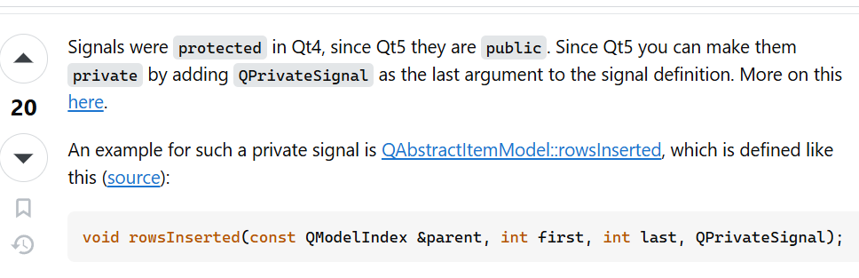
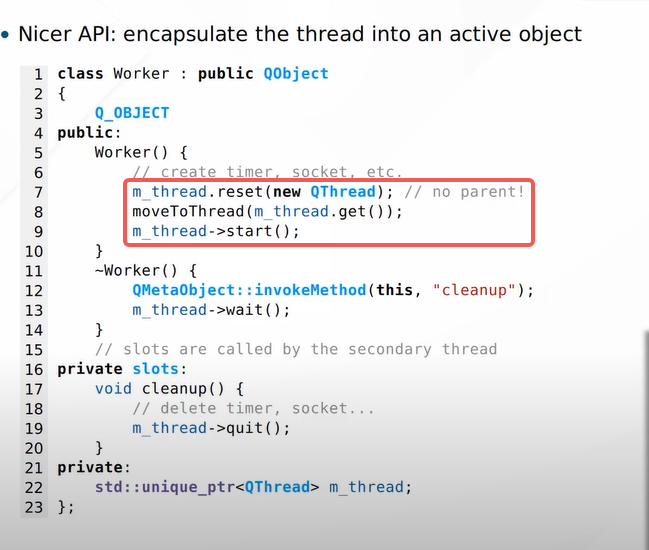

- Signal
	- lambda
		- ```C++
		  connect(
		      sender, &Sender::valueChanged,
		      [=]( **const** QString &newValue ) { receiver->updateValue( "senderValue", newValue ); }
		  );
		  ```
	- Private Signal
		- {:height 151, :width 444}
- Event
	- Qt has `nativeEvent` and normal event, after `nativeEvent` the result will pass to normal event
		- `nativeEvent` control from system level
			- Example: [QAbstractNativeEventFilter监听USB热插拔事件-CSDN博客](https://blog.csdn.net/qq_36551444/article/details/126028571?spm=1001.2101.3001.6650.2&utm_medium=distribute.pc_relevant.none-task-blog-2%7Edefault%7ECTRLIST%7ERate-2-126028571-blog-82428500.235%5Ev43%5Epc_blog_bottom_relevance_base2&depth_1-utm_source=distribute.pc_relevant.none-task-blog-2%7Edefault%7ECTRLIST%7ERate-2-126028571-blog-82428500.235%5Ev43%5Epc_blog_bottom_relevance_base2)
			- for Windows: the message flags can refer to [Windows窗口消息大全,全不全自己看 - Sunwayking - 博客园 (cnblogs.com)](https://www.cnblogs.com/Sunwayking/articles/2817580.html)
		- related classes
			- [QAbstractNativeEventFilter Class | Qt Core 6.7.1](https://doc.qt.io/qt-6/qabstractnativeeventfilter.html)
	- Qt EventLoop
		- [Qt事件循环及QEventLoop的使用_qt qeventloop-CSDN博客](https://blog.csdn.net/kupepoem/article/details/121844578)
		- [Understanding Qt's Event Loop and Signals/Slots - deKonvoluted](https://dekonvoluted.github.io/programming/2018/09/16/qt-event-loop.html)
		  id:: 672cd568-83b1-4f18-a5d3-1da4c52e1195
		-
	- Threading
		- `QMutexLocker`: better and simpler version of `QMutex`
		- `QWaitCondition`: a condition
		- Wrap QThread inside Worker
		  {:height 298, :width 353}
- Reference
	- [Qt5 C++ GUI Development Full Course For Beginners | C++ GUI](https://www.youtube.com/watch?v=Et_bgnJ_Hhg)
- [A Qt Demo created by me](https://github.com/Kexin-Wei/QTCppCallPython_Demo)