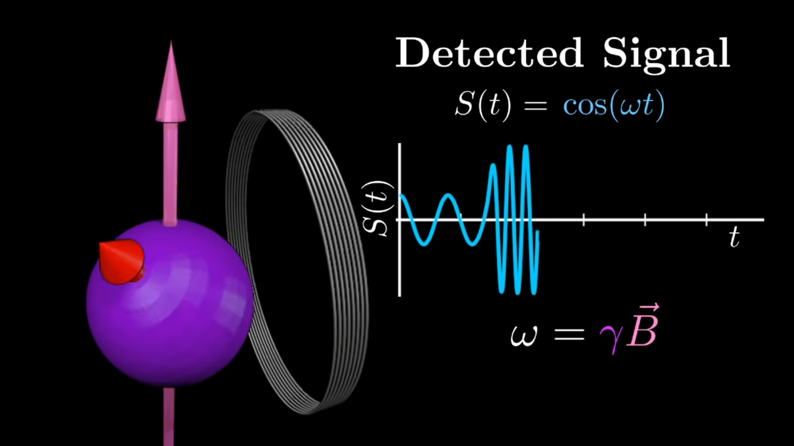

- Proton Spin
	- {{video https://www.youtube.com/watch?v=JFSU9X11wyY}}
	- [Larmor precession - Wikipedia](https://en.wikipedia.org/wiki/Larmor_precession)
		- The Larmor or precession frequency is the rate at which spins wobble when placed in a magnetic field.
		- $\omega_0=\gamma B_0$
			- $\gamma$: gyromagnetic ratio
	- Stable State
		- into a stable state, longitudinal magnetization Mz is building up in the z-direction because the magnetic vectors representing the individual magnetic moments add together
- Lez's Law
	- $\mathcal{E}=-\frac{\mathrm{d} \Phi_{\mathrm{B}}}{\mathrm{d} t}$
- Resonance Condition
	- Energy can be introduced into such a stable spin system by applying an electromagnetic wave of the same frequency as the Larmor frequency
- Excitation
	- {{video https://www.youtube.com/watch?v=wZkoKVDz0rY}}
- Detected Signal
	- 
- Flip angle
	- 
- Relaxation Time
	- 