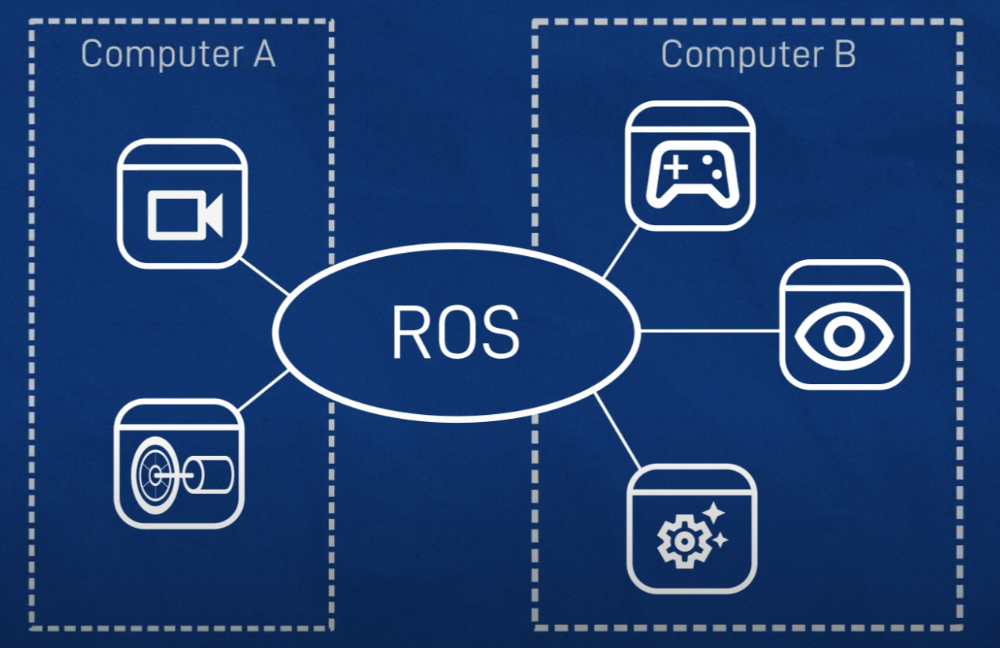
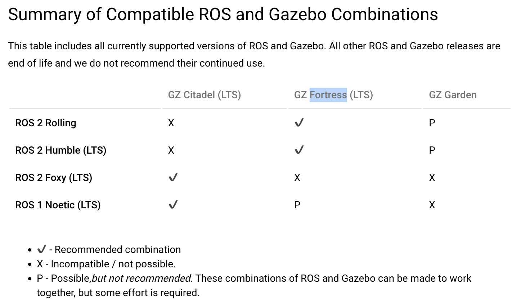
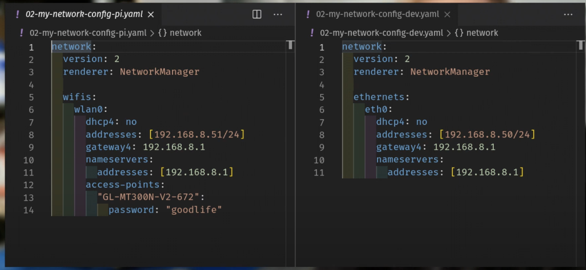

- Following [Youtube Tutorial](https://youtube.com/playlist?list=PLunhqkrRNRhYYCaSTVP-qJnyUPkTxJnBt)
- Hardware Setup
	- Raspberry Pi 4 (or Serv Machine): ubuntu server 20 + lubuntu
	  > IP: kk@192.168.50.55
	- Dev Machine: VirtualBox Ubuntu 20 on macbook
	- {:height 203, :width 304}
- Installation
	- Chose Version on machine
	  collapsed:: true
		- Ros 2 Foxy + Citadel
		- 
	- ~~macOS 13 -> [Gazebo Fortress](https://gazebosim.org/docs/fortress)~~
	  collapsed:: true
		- has issue, can't run simulation, give up
	- Dev Machine in VirtualBox
	  collapsed:: true
		- How to setup network in VirtualBox
			- [Explanation of the Network Setting in VirtualBox](https://www.nakivo.com/blog/virtualbox-network-setting-guide/)
			- chose bridged network
		- Setup netplan
			- Following [this](https://youtu.be/NW97xLF7CYQ?t=403)
				- 
			- Raspberry pi same as right side, beware of the gateway, first three numbers should be same as the address
			- VirtualBox Ubuntu Dev Machine
			  collapsed:: true
				- ```yaml 
				  network:
				    version: 2
				    renderer: NetworkManager
				  
				    ethernets:
				      enp0s3:
				        dhcp4: no
				        addresses: [192.168.50.133/24]
				        gateway4: 192.168.50.1
				        nameservers:
				          addresses: [192.168.50.1]
				  ```
			- run restart netplan command on both sides
				- ```bash
				  sudo netplan generate
				  sudo netplan apply
				  ```
		- Connect from Dev Machine to Raspberry Pi using ssh
			- install openssh: `sudo apt install openssh-server`
			- change ssh setting in Serv Machine: `sudo nvim /etc/ssh/sshd_config`
			- change following parts
			  ```txt
			  #To enable password authentication, uncomment
			  PasswordAuthentication yes
			  
			  #To enable root login, uncomment
			  PermitRootLogin yes
			  
			  #To enable SSH key login, uncomment
			  PubkeyAuthentication yes
			  ```
		- Run `source /opt/ros/foxy/setup.bash` and `ros2 run demo_nodes_cpp talker` in Raspberry Pi and Run `source /opt/ros/foxy/setup.bash` and `ros2 run demo_nodes_py listener` in Dev Machine.
		  > add source to file : `echo "source /opt/ros/foxy/setup.bash" >> ~/.bashrc`
		- Install colcon at both sides, `echo "source /opt/ros/foxy/setup.bash" >> ~/.bashrc`