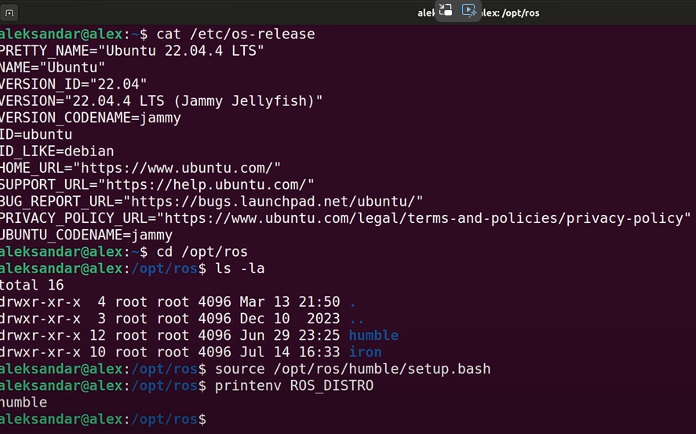

# Install
	- follow the document of the corresponding version
	- install colcon
		- ```bash
		  sudo sh -c 'echo "deb [arch=amd64,arm64] http://repo.ros2.org/ubuntu/main `lsb_release -cs` main" > /etc/apt/sources.list.d/ros2-latest.list'
		  curl -s https://raw.githubusercontent.com/ros/rosdistro/master/ros.asc | sudo apt-key add -
		  sudo apt update
		  sudo apt install python3-colcon-common-extensions
		  ```
	- install gazebo
		- ```bash
		  sudo apt install ros-humble-gazebo* # humble only, Jazzy look online
		  ```
	- Multiple version ROS
		- 
- # Environment set up
	- Add source in Ubuntu `.bashrc`
	  ```bash
	  # ros2
	  source /opt/ros/humble/setup.bash
	  source /usr/share/colcon_cd/function/colcon_cd-argcomplete.bash
	  source ~/ros2_ws/install/setup.bash
	  
	  # gazebo
	  source /usr/share/gazebo/setup.bash
	  
	  # nav2
	  export TURTLEBOT3_MODEL=waffle
	  export RMW_IMPLEMENTATION=rmw_cyclonedds_cpp # a fix
	  ```
- # [[ROS Concepts]]
- # [[ROS Visualization]]
- # [[ROS & Docker]]
- # [[ROS2 & Navigation 2]]
- # ROS2 & Moveit2
	- [MoveIt 2 Source Build - Linux | MoveIt](https://moveit.ai/install-moveit2/source/)
		- (Missing packages) [Installation Tutorial for Humble](https://moveit.picknik.ai/humble/doc/tutorials/getting_started/getting_started.html#)
	- [List of Tutorials](https://moveit.picknik.ai/humble/doc/tutorials/tutorials.html)
	- ```bash
	  ros2 pkg create \
	   --build-type ament_cmake \
	   --dependencies moveit_ros_planning_interface rclcpp \
	   --node-name hello_moveit hello_moveit
	  ```
	- ## Moveit_visual_tools
		- [moveit/moveit_visual_tools: Helper functions for displaying and debugging MoveIt! data in Rviz via published markers](https://github.com/moveit/moveit_visual_tools/tree/ros2)
		- ```bash
		  # add in package.xml
		  <depend>moveit_visual_tools</depend>
		  
		  # add in CMakeLists.txt
		  find_package(moveit_visual_tools REQUIRED)
		  ament_target_dependencies(
		    hello_moveit
		    "moveit_ros_planning_interface"
		    "moveit_visual_tools"
		    "rclcpp"
		  )
		  
		  # add in cpp
		  #include <moveit_visual_tools/moveit_visual_tools.h>
		  ```
		- Call render
			- ```C++
			  moveit_visual_tools.trigger();
			  ```
		- Can draw text
			- ```c++
			  // create a closure for visualization
			  auto const draw_title = [&moveit_visual_tools](auto text) {
			    auto const text_pose = [] {
			      auto msg = Eigen::Isometry3d::Identity();
			      msg.translation().z() = 1.0;
			      return msg;
			    }();
			    moveit_visual_tools.publishText(text_pose, text,
			                                    rviz_visual_tools::WHITE,
			                                    rviz_visual_tools::XLARGE);
			  };
			  ```
		- Can print log
			- ```C++
			  auto const prompt = [&moveit_visual_tools](auto text) {
			    moveit_visual_tools.prompt(text);
			  };
			  ```
		- Can draw trajectory
			- ```C++
			  auto const draw_trajectory_tool_path =
			    [&moveit_visual_tools,
			     jmg = move_group_interface.getRobotModel()->getJointModelGroup(
			       "panda_arm")](auto const trajectory) {
			    moveit_visual_tools.publishTrajectoryLine(trajectory, jmg);
			  };
			  ```
		- Need to add a spinner to call
			- ```C++
			  rclcpp::executors::SingleThreadedExecutor executor;
			      executor.add_node(node);
			      auto spinner = std::thread([&executor]() { executor.spin(); });
			  
			  // later on 
			  rclcpp::shutdown();
			  spinner.join();
			  ```
		- `PlanningSceneInterface` add collision
			- ```C++
			  // Add the collision object to the scene
			  moveit::planning_interface::PlanningSceneInterface planning_scene_interface;
			  planning_scene_interface.applyCollisionObject(collision_object);
			  ```
	- ## Universal Robots
		- [Universal Robots A/S](https://github.com/UniversalRobots)
		- Clone these repositories in `src` and run `rosdep update && rosdep install --ignore-src --from-paths . -y`
			- [UniversalRobots/Universal_Robots_ROS2_Gazebo_Simulation](https://github.com/UniversalRobots/Universal_Robots_ROS2_Gazebo_Simulation)
			- [UniversalRobots/Universal_Robots_ROS2_Description: ROS2 URDF description for Universal Robots](https://github.com/UniversalRobots/Universal_Robots_ROS2_Description)
		- use gazebo rviz simulation as a base
			- ```bash
			  ros2 launch ur_simulation_gazebo ur_sim_moveit.launch.py
			  ```
		-
- # ROS in Raspberry Pi
	- [ROS 2 on Raspberry Pi — ROS 2 Documentation: Jazzy documentation](http://docs.ros.org/en/jazzy/How-To-Guides/Installing-on-Raspberry-Pi.html)
- # Tips
	- Ros remap node name from `launch`
		- 