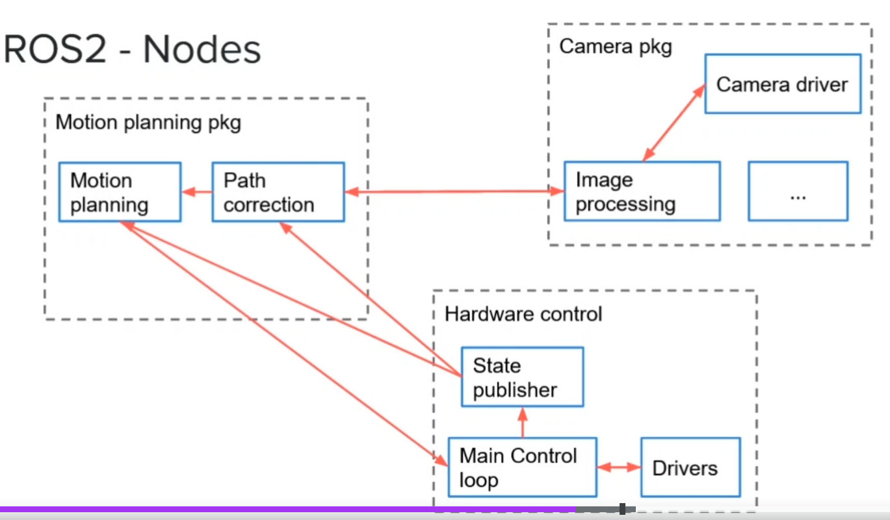

- Node: every program / threading
- Topic & message: how nodes communicate with each other
- Services: one time function
- Ros remap node name from `launch`
	- 
- Package
	- {:height 201, :width 381}
	- dependence
	  
- Workspace
	- 
- [Quality of Service QoS](https://docs.ros.org/en/foxy/Concepts/About-Quality-of-Service-Settings.html)
- Add source in Ubuntu `.bashrc`
  ```bash
  # ros jazzy evn set up
  source /opt/ros/jazzy/setup.bash # ros command
  source /usr/share/colcon_cd/function/colcon_cd-argcomplete.bash #colcon autocomplete
  source ~/ros2_ws/install/setup.bash # workspace command
  ```
- File structure
	- WS
		- src
			- my_package
				- package.xml
- create c++ or python package
  ```bash
  ros2 pkg create my_py_pkg --build-type ament_python --dependencies rclpy
  ros2 pkg create my_cpp_pkg --build-type ament_cmake --dependencies rclcpp
  ```
- {:height 463, :width 778}
- ```bash
  ros2 pkg create A_NEW_PACKAGE
  # rename a node
  ros2 run A_PACKAGE A_NODE -r __node:=A_NEW_NAME
  ros2 node list
  ros2 node info /A_NODE
  
  colcon build --packages-select A_PACKAGE --symlink-install
  
  
  # topic
  ros2 topic list
  ros2 topic info /A_TOPIC
  ros2 topic hz /A_TOPIC
  ros2 topic bw /A_TOPIC
  
  # publish directly
  ros2 topic pub -r 10 /robot_news example_interfaces/msg/String "{data: 'hello from termina'}"
  
  # rename a topic
  ros2 run my_cpp_pkg robot_news_station --ros-args -r __node:=my_station -r robot_news:=my_news
  
  # interface
  ros2 show interface show example_interfaces/msg/String
  ros2 interface show geometry_msgs/msg/Twist
  
  # service
  ros2 service list
  ros2 service call /add_two_ints example_interfaces/srv/AddTwoInts  "{a: 2,b: 4}"
  ```