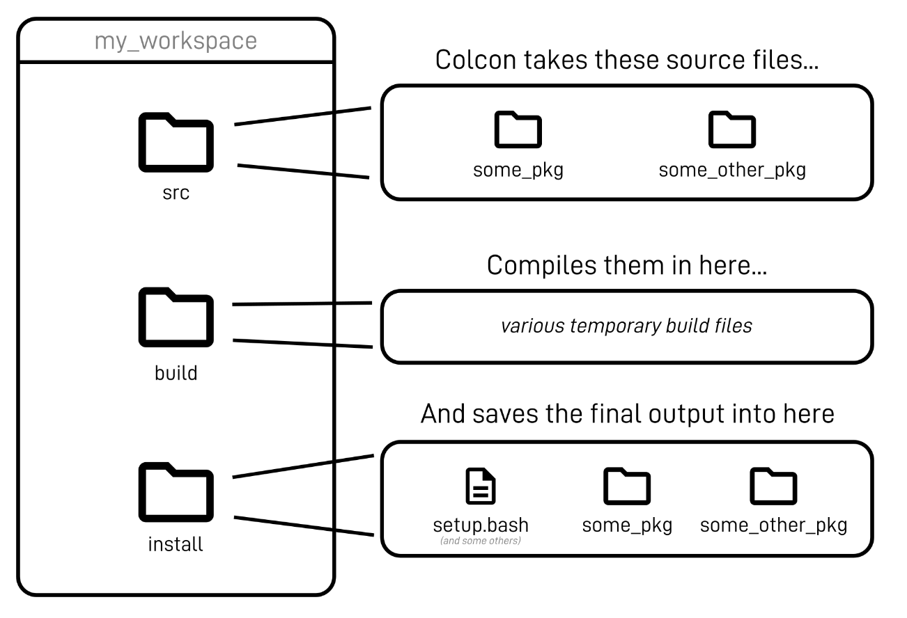
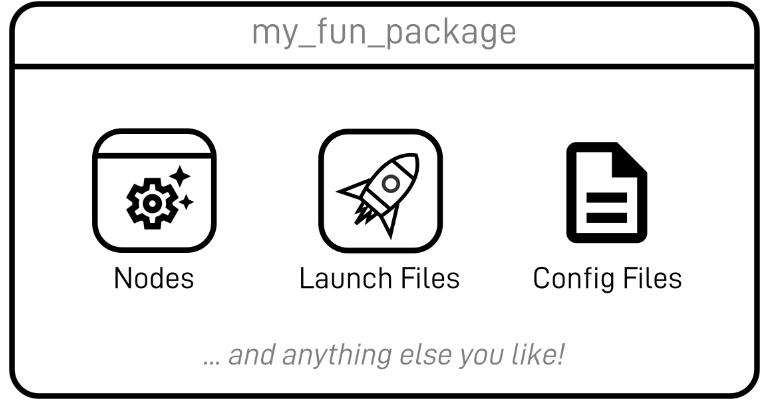
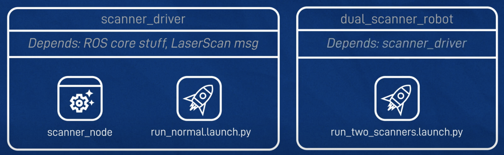

# Environment set up
	- Add source in Ubuntu `.bashrc`
	  ```bash
	  # ros jazzy evn set up
	  source /opt/ros/jazzy/setup.bash # ros command
	  source /usr/share/colcon_cd/function/colcon_cd-argcomplete.bash #colcon autocomplete
	  source ~/ros2_ws/install/setup.bash # workspace command
	  ```
- # ROS Concepts
	- ## Workspace
		- 
		- [Quality of Service QoS](https://docs.ros.org/en/foxy/Concepts/About-Quality-of-Service-Settings.html)
		- File structure
			- WS
				- src
					- my_package
						- package.xml
	- ## Package
		- {:height 201, :width 381}
		- dependence
		  
		- create c++ or python package
		  ```bash
		  ros2 pkg create my_py_pkg --build-type ament_python --dependencies rclpy
		  ros2 pkg create my_cpp_pkg --build-type ament_cmake --dependencies rclcpp
		  
		  colcon build --packages-select A_PACKAGE --symlink-install
		  ```
	- ## Node
		- every program / threading
		- ```bash
		  # rename a node
		  ros2 run A_PACKAGE A_NODE -r __node:=A_NEW_NAME
		  ros2 node list
		  ros2 node info /A_NODE
		  ```
	- ## Topic
		- & message: how nodes communicate with each other
		- ```bash
		  # topic
		  ros2 topic list
		  ros2 topic info /A_TOPIC
		  ros2 topic hz /A_TOPIC
		  ros2 topic bw /A_TOPIC
		  
		  # publish directly
		  ros2 topic pub -r 10 /robot_news example_interfaces/msg/String "{data: 'hello from termina'}"
		  
		  # rename a topic
		  ros2 run my_cpp_pkg robot_news_station --ros-args -r __node:=my_station -r robot_news:=my_news
		  ```
	- ## Services
		- one time function
		- ```bash
		  # service
		  ros2 service list
		  ros2 service call /add_two_ints example_interfaces/srv/AddTwoInts  "{a: 2,b: 4}"
		  ```
	- ## Interface
		- ```bash
		  # interface
		  ros2 show interface show example_interfaces/msg/String
		  ros2 interface show geometry_msgs/msg/Twist
		  ros2 interface package service_msgs
		  ```
- # ROS & Docker
	- [Setup ROS 2 with VSCode and Docker [community-contributed] — ROS 2 Documentation: Jazzy documentation](http://docs.ros.org/en/jazzy/How-To-Guides/Setup-ROS-2-with-VSCode-and-Docker-Container.html)
- # ROS in Raspberry Pi
	- [ROS 2 on Raspberry Pi — ROS 2 Documentation: Jazzy documentation](http://docs.ros.org/en/jazzy/How-To-Guides/Installing-on-Raspberry-Pi.html)
- # Tips
	- Ros remap node name from `launch`
		- 