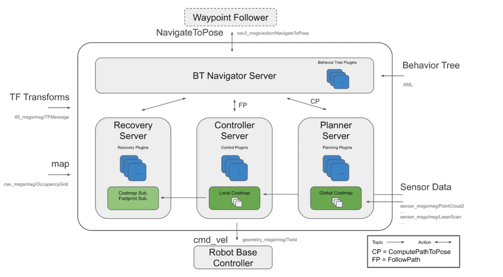
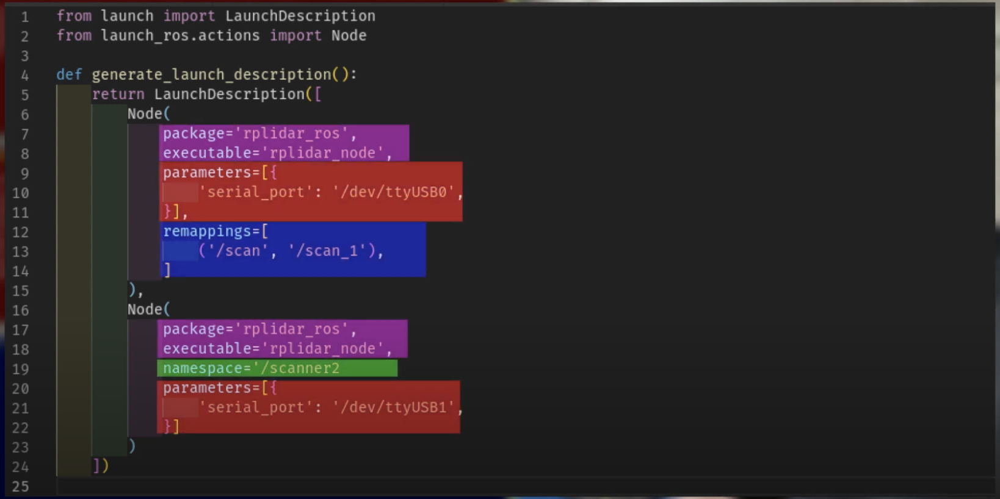

# Install
	- follow the document of the corresponding version
	- install colcon
		- ```bash
		  sudo sh -c 'echo "deb [arch=amd64,arm64] http://repo.ros2.org/ubuntu/main `lsb_release -cs` main" > /etc/apt/sources.list.d/ros2-latest.list'
		  curl -s https://raw.githubusercontent.com/ros/rosdistro/master/ros.asc | sudo apt-key add -
		  sudo apt update
		  sudo apt install python3-colcon-common-extensions
		  ```
	- install gazebo
		- ```bash
		  sudo apt install ros-humble-gazebo* # humble only, Jazzy look online
		  ```
- # Environment set up
	- Add source in Ubuntu `.bashrc`
	  ```bash
	  # ros2
	  source /opt/ros/humble/setup.bash
	  source /usr/share/colcon_cd/function/colcon_cd-argcomplete.bash
	  source ~/ros2_ws/install/setup.bash
	  
	  # gazebo
	  source /usr/share/gazebo/setup.bash
	  
	  # nav2
	  export TURTLEBOT3_MODEL=waffle
	  export RMW_IMPLEMENTATION=rmw_cyclonedds_cpp # a fix
	  ```
- # [[ROS Concepts]]
- # ROS Visualization
	- run urdf demo
		- ```bash
		  ros2 launch urdf_tutorial display.launch.py model:=/opt/ros/jazzy/share/urdf_tutorial/urdf/08-macroed.urdf.xacro 
		  ```
		- Models, TFs
	- visualize TFs
		- ```bash
		  # install package
		  sudo apt install ros-jazzy-tf2-tools
		  
		  # run when demo running
		  ros2 run tf2_tools view_frames # generate frams.gv and pdf in current diretory
		  ```
		- ```bash
		  ros2 run robot_state_publisher robot_state_publisher --ros-args -p robot_description:="$(xacro a_car.urdf)"
		  ros2 run joint_state_publisher_gui joint_state_publisher_gui
		  ros2 run rviz2 rviz2
		  ```
	- Gazebo (harmonic)
		- ```bash
		  # terminal 1
		  ros2 run robot_state_publisher robot_state_publisher --ros-args -p robot_description:="$(xacro /home/<user>/my_robot_ws/src/my_robot_description/urdf/my_robot.urdf.xacro)"
		  # terminal 2
		  ros2 launch ros_gz_sim gz_sim.launch.py gz_args:="empty.sdf -r"
		  # terminal 3
		  ros2 run ros_gz_sim create -topic robot_description
		  ```
		- ```bash
		      <include 
		       file="$(find-pkg-share ros_gz_sim)/launch/gz_sim.launch.py">
		      <arg name="gz_args" value="empty.sdf -r" />
		      </include>
		      
		      <node pkg="ros_gz_sim" exec="create" args="-topic robot_description" />
		  ```
- # [[ROS & Docker]]
- # ROS2 & Navigation 2
	- installation
		- ```bash
		  # install
		  sudo apt install ros-<ros2-distro>-navigation2 ros-<ros2-distro>-nav2-bringup
		  
		  # install demo
		  sudo apt install ros-<ros2-distro>-nav2-minimal-tb* # jazzy
		  # or 
		  sudo apt install ros-<ros2-distro>-turtlebot3-gazebo # humble
		  ```
	- Fix speed issue
		- ROS 2 RMW for Eclipse Cyclone DDS
		  **Easy, fast, reliable, small [Eclipse Cyclone DDS](https://github.com/eclipse-cyclonedds/cyclonedds) Tier 1 ROS middleware** for ROS 2. Make your **🐢 run like a 🚀**
		- ```bash
		  sudo apt install ros-<ros2-distro>-rmw-cyclonedds-cpp
		  ```
	- Run turtle bot to get map
		- ```bash
		  # launch gazebo
		  ros2 launch turtlebot3_gazebo turtlebot3_world.launch.py 
		  
		  # open robot controller
		  ros2 run turtlebot3_teleop teleop_keyboard
		  
		  # launch rviz
		  ros2 launch  turtlebot3_cartographer cartographer.launch.py use_sim_time:=True
		  
		  # save map
		  ros2 run nav2_map_server map_saver_cli -f maps/map_house
		  ```
	- Use map to navigate
		- Code
		  ```bash
		  # launch gazebo
		  ros2 launch turtlebot3_gazebo turtlebot3_world.launch.py 
		  # launch navigation tool
		  ros2 launch turtlebot3_navigation2 navigation2.launch.py use_sim_time:=True map:=maps/map_world.yaml 
		  ```
		- 
		- Nav2 architecture
			- 
		-
- # ROS in Raspberry Pi
	- [ROS 2 on Raspberry Pi — ROS 2 Documentation: Jazzy documentation](http://docs.ros.org/en/jazzy/How-To-Guides/Installing-on-Raspberry-Pi.html)
- # Tips
	- Ros remap node name from `launch`
		- 