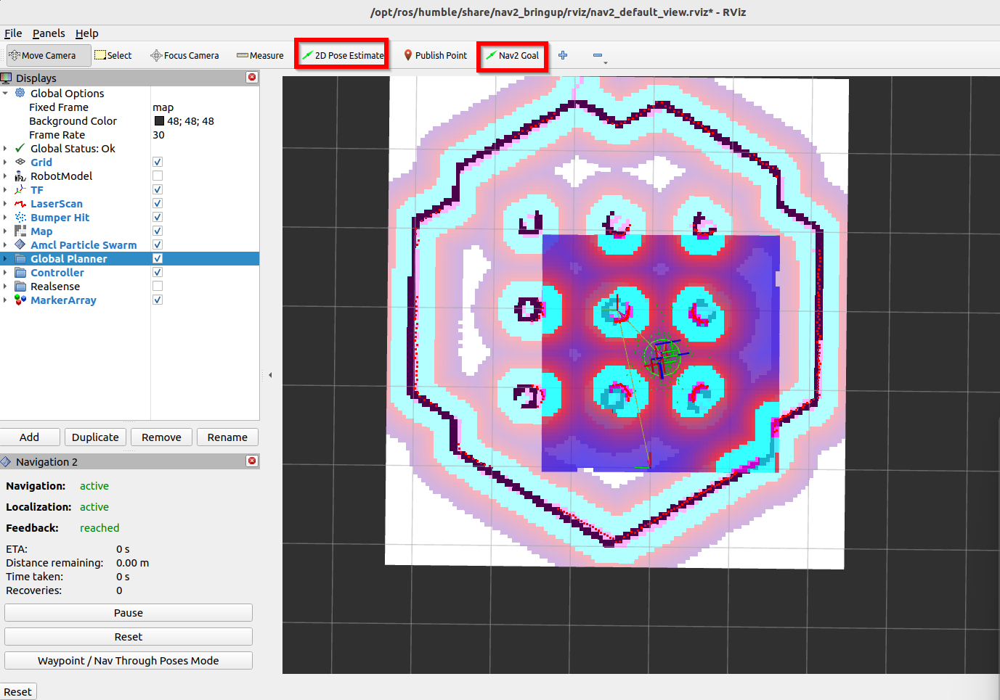
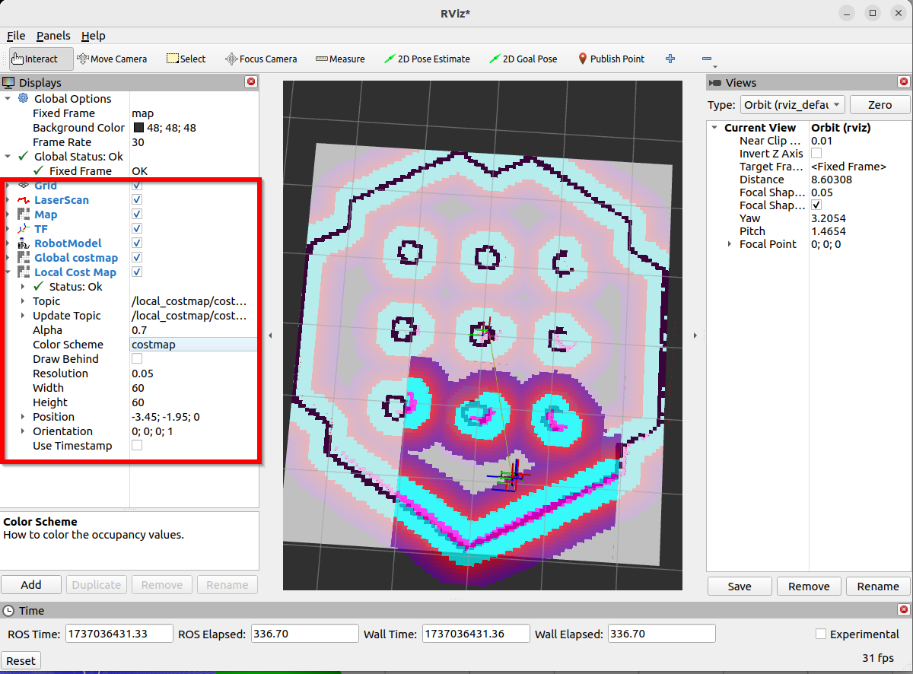

# Install
	- follow the document of the corresponding version
	- install colcon
		- ```bash
		  sudo sh -c 'echo "deb [arch=amd64,arm64] http://repo.ros2.org/ubuntu/main `lsb_release -cs` main" > /etc/apt/sources.list.d/ros2-latest.list'
		  curl -s https://raw.githubusercontent.com/ros/rosdistro/master/ros.asc | sudo apt-key add -
		  sudo apt update
		  sudo apt install python3-colcon-common-extensions
		  ```
	- install gazebo
		- ```bash
		  sudo apt install ros-humble-gazebo* # humble only, Jazzy look online
		  ```
	- Multiple version ROS
		- 
- # Environment set up
	- ## [[ROS & Docker]]
	- Add source in Ubuntu `.bashrc`
	  ```bash
	  # ros2
	  source /opt/ros/humble/setup.bash
	  source /usr/share/colcon_cd/function/colcon_cd-argcomplete.bash
	  source ~/ros2_ws/install/setup.bash
	  
	  # gazebo
	  source /usr/share/gazebo/setup.bash
	  
	  # nav2
	  export TURTLEBOT3_MODEL=waffle
	  export RMW_IMPLEMENTATION=rmw_cyclonedds_cpp # a fix
	  ```
- # [[ROS Concepts]]
- # ROS Visualization - Rviz and Gazebo
	- run urdf demo
		- ```bash
		  ros2 launch urdf_tutorial display.launch.py model:=/opt/ros/jazzy/share/urdf_tutorial/urdf/08-macroed.urdf.xacro 
		  ```
		- Models, TFs
	- visualize TFs
		- ```bash
		  # install package
		  sudo apt install ros-jazzy-tf2-tools
		  
		  # run when demo running
		  ros2 run tf2_tools view_frames # generate frams.gv and pdf in current diretory
		  ```
		- ```bash
		  ros2 run robot_state_publisher robot_state_publisher --ros-args -p robot_description:="$(xacro a_car.urdf)"
		  ros2 run joint_state_publisher_gui joint_state_publisher_gui
		  ros2 run rviz2 rviz2
		  ```
	- Gazebo (harmonic)
		-
		- ```bash
		  # terminal 1
		  ros2 run robot_state_publisher robot_state_publisher --ros-args -p robot_description:="$(xacro /home/<user>/my_robot_ws/src/my_robot_description/urdf/my_robot.urdf.xacro)"
		  # terminal 2
		  ros2 launch ros_gz_sim gz_sim.launch.py gz_args:="empty.sdf -r"
		  # terminal 3
		  ros2 run ros_gz_sim create -topic robot_description
		  ```
		- ```bash
		      <include 
		       file="$(find-pkg-share ros_gz_sim)/launch/gz_sim.launch.py">
		      <arg name="gz_args" value="empty.sdf -r" />
		      </include>
		      
		      <node pkg="ros_gz_sim" exec="create" args="-topic robot_description" />
		  ```
-
- # ROS2 & Navigation 2
	- installation
		- ```bash
		  # install
		  sudo apt install ros-<ros2-distro>-navigation2 ros-<ros2-distro>-nav2-bringup
		  
		  # install demo
		  sudo apt install ros-<ros2-distro>-nav2-minimal-tb* # jazzy
		  # or 
		  sudo apt install ros-<ros2-distro>-turtlebot3-gazebo # humble
		  ```
	- Fix speed issue
		- ROS 2 RMW for Eclipse Cyclone DDS
		  **Easy, fast, reliable, small [Eclipse Cyclone DDS](https://github.com/eclipse-cyclonedds/cyclonedds) Tier 1 ROS middleware** for ROS 2. Make your **🐢 run like a 🚀**
		- ```bash
		  sudo apt install ros-<ros2-distro>-rmw-cyclonedds-cpp
		  ```
	- Run turtle bot to get map
		- ```bash
		  # launch gazebo
		  ros2 launch turtlebot3_gazebo turtlebot3_world.launch.py 
		  
		  # open robot controller
		  ros2 run turtlebot3_teleop teleop_keyboard
		  
		  # launch rviz
		  ros2 launch  turtlebot3_cartographer cartographer.launch.py use_sim_time:=True
		  
		  # save map
		  ros2 run nav2_map_server map_saver_cli -f maps/map_house
		  ```
	- Use map to navigate
		- Code
		  ```bash
		  # launch gazebo
		  ros2 launch turtlebot3_gazebo turtlebot3_world.launch.py 
		  # launch navigation tool
		  ros2 launch turtlebot3_navigation2 navigation2.launch.py use_sim_time:=True map:=maps/map_world.yaml 
		  ```
		- Put robot: 2D pose Estimate
			- 
		- Nav2 architecture
			- 
	- Self-robot
		- ```bash
		  # start robot in gazebo
		  ros2 launch turtlebot3_gazebo turtlebot3_world.launch.py 
		  
		  # open navigation
		  ros2 launch nav2_bringup navigation_launch.py  use_sim_time:=True
		  
		  # open map generation
		  ros2 launch slam_toolbox online_sync_launch.py use_sim_time:=True
		  
		  # open rviz2
		  ros2 run rviz2 rviz2 
		  
		  # save map
		  ros2 run nav2_map_server map_saver_cli -f maps/world_slambox
		  ```
		- add items freely and select correct topic / color map / durability
			- 
- # ROS2 & Moveit2
	- [MoveIt 2 Source Build - Linux | MoveIt](https://moveit.ai/install-moveit2/source/)
		- (Missing packages) [Installation Tutorial for Humble](https://moveit.picknik.ai/humble/doc/tutorials/getting_started/getting_started.html#)
	- [List of Tutorials](https://moveit.picknik.ai/humble/doc/tutorials/tutorials.html)
	- ```bash
	  ros2 pkg create \
	   --build-type ament_cmake \
	   --dependencies moveit_ros_planning_interface rclcpp \
	   --node-name hello_moveit hello_moveit
	  ```
	- ## Moveit_visual_tools
		- [moveit/moveit_visual_tools: Helper functions for displaying and debugging MoveIt! data in Rviz via published markers](https://github.com/moveit/moveit_visual_tools/tree/ros2)
		- ```bash
		  # add in package.xml
		  <depend>moveit_visual_tools</depend>
		  
		  # add in CMakeLists.txt
		  find_package(moveit_visual_tools REQUIRED)
		  ament_target_dependencies(
		    hello_moveit
		    "moveit_ros_planning_interface"
		    "moveit_visual_tools"
		    "rclcpp"
		  )
		  
		  # add in cpp
		  #include <moveit_visual_tools/moveit_visual_tools.h>
		  ```
		- Call render
			- ```C++
			  moveit_visual_tools.trigger();
			  ```
		- Can draw text
			- ```c++
			  // create a closure for visualization
			  auto const draw_title = [&moveit_visual_tools](auto text) {
			    auto const text_pose = [] {
			      auto msg = Eigen::Isometry3d::Identity();
			      msg.translation().z() = 1.0;
			      return msg;
			    }();
			    moveit_visual_tools.publishText(text_pose, text,
			                                    rviz_visual_tools::WHITE,
			                                    rviz_visual_tools::XLARGE);
			  };
			  ```
		- Can print log
			- ```C++
			  auto const prompt = [&moveit_visual_tools](auto text) {
			    moveit_visual_tools.prompt(text);
			  };
			  ```
		- Can draw trajectory
			- ```C++
			  auto const draw_trajectory_tool_path =
			    [&moveit_visual_tools,
			     jmg = move_group_interface.getRobotModel()->getJointModelGroup(
			       "panda_arm")](auto const trajectory) {
			    moveit_visual_tools.publishTrajectoryLine(trajectory, jmg);
			  };
			  ```
		- Need to add a spinner to call
			- ```C++
			  rclcpp::executors::SingleThreadedExecutor executor;
			      executor.add_node(node);
			      auto spinner = std::thread([&executor]() { executor.spin(); });
			  
			  // later on 
			  rclcpp::shutdown();
			  spinner.join();
			  ```
		- `PlanningSceneInterface` add collision
			- ```C++
			  // Add the collision object to the scene
			  moveit::planning_interface::PlanningSceneInterface planning_scene_interface;
			  planning_scene_interface.applyCollisionObject(collision_object);
			  ```
	- ## Universal Robots
		- [Universal Robots A/S](https://github.com/UniversalRobots)
		- Clone these repositories in `src` and run `rosdep update && rosdep install --ignore-src --from-paths . -y`
			- [UniversalRobots/Universal_Robots_ROS2_Gazebo_Simulation](https://github.com/UniversalRobots/Universal_Robots_ROS2_Gazebo_Simulation)
			- [UniversalRobots/Universal_Robots_ROS2_Description: ROS2 URDF description for Universal Robots](https://github.com/UniversalRobots/Universal_Robots_ROS2_Description)
		- use gazebo rviz simulation as a base
			- ```bash
			  ros2 launch ur_simulation_gazebo ur_sim_moveit.launch.py
			  ```
		-
- # ROS in Raspberry Pi
	- [ROS 2 on Raspberry Pi — ROS 2 Documentation: Jazzy documentation](http://docs.ros.org/en/jazzy/How-To-Guides/Installing-on-Raspberry-Pi.html)
- # Tips
	- Ros remap node name from `launch`
		- 