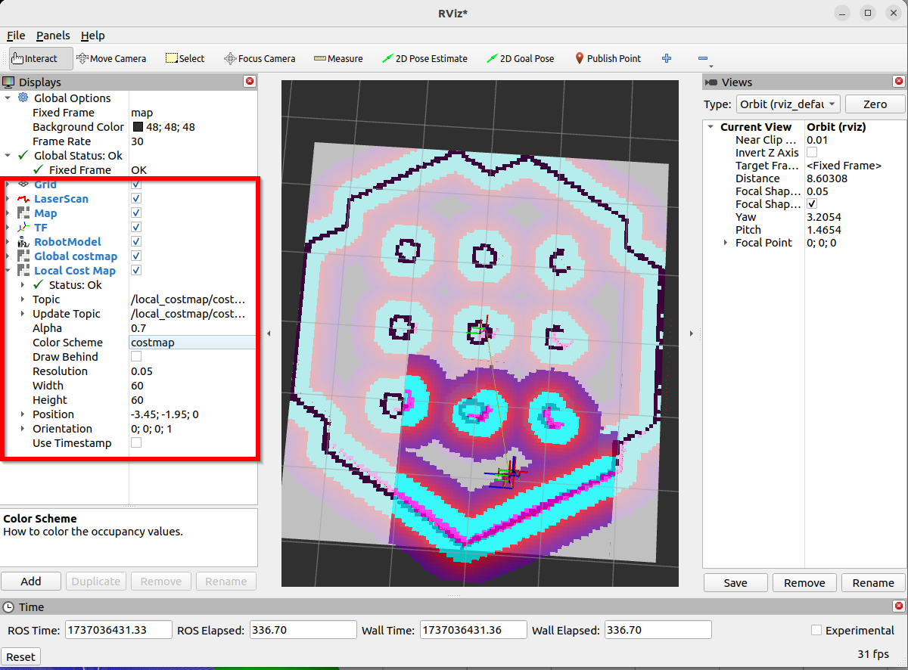

- installation
	- ```bash
	  # install
	  sudo apt install ros-<ros2-distro>-navigation2 ros-<ros2-distro>-nav2-bringup
	  
	  # install demo
	  sudo apt install ros-<ros2-distro>-nav2-minimal-tb* # jazzy
	  # or 
	  sudo apt install ros-<ros2-distro>-turtlebot3-gazebo # humble
	  ```
- Fix speed issue
	- ROS 2 RMW for Eclipse Cyclone DDS
	  **Easy, fast, reliable, small [Eclipse Cyclone DDS](https://github.com/eclipse-cyclonedds/cyclonedds) Tier 1 ROS middleware** for ROS 2. Make your **🐢 run like a 🚀**
	- ```bash
	  sudo apt install ros-<ros2-distro>-rmw-cyclonedds-cpp
	  ```
- Run turtle bot to get map
	- ```bash
	  # launch gazebo
	  ros2 launch turtlebot3_gazebo turtlebot3_world.launch.py 
	  
	  # open robot controller
	  ros2 run turtlebot3_teleop teleop_keyboard
	  
	  # launch rviz
	  ros2 launch  turtlebot3_cartographer cartographer.launch.py use_sim_time:=True
	  
	  # save map
	  ros2 run nav2_map_server map_saver_cli -f maps/map_house
	  ```
- Use map to navigate
	- Code
	  ```bash
	  # launch gazebo
	  ros2 launch turtlebot3_gazebo turtlebot3_world.launch.py 
	  # launch navigation tool
	  ros2 launch turtlebot3_navigation2 navigation2.launch.py use_sim_time:=True map:=maps/map_world.yaml 
	  ```
	- Put robot: 2D pose Estimate
		- 
	- Nav2 architecture
		- 
- Self-robot
	- ```bash
	  # start robot in gazebo
	  ros2 launch turtlebot3_gazebo turtlebot3_world.launch.py 
	  
	  # open navigation
	  ros2 launch nav2_bringup navigation_launch.py  use_sim_time:=True
	  
	  # open map generation
	  ros2 launch slam_toolbox online_sync_launch.py use_sim_time:=True
	  
	  # open rviz2
	  ros2 run rviz2 rviz2 
	  
	  # save map
	  ros2 run nav2_map_server map_saver_cli -f maps/world_slambox
	  ```
	- add items freely and select correct topic / color map / durability
		- 