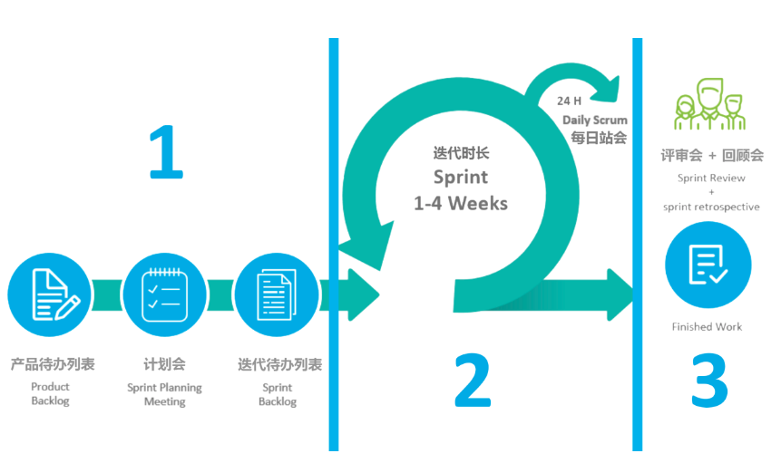
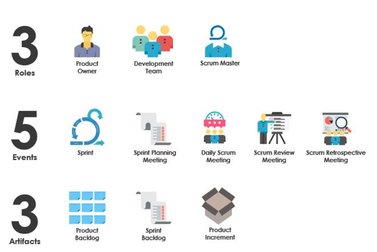

- 
- 
- [Home | Scrum Guides](https://scrumguides.org/)
- [8/17 - Scrum Master are now "Leaders Who Serve" - YouTube](https://www.youtube.com/watch?v=U-eOrsCWVrk&list=PLMWjHyTcdqkZ6fUroGstR6NKL6RQhaFJT&index=9)
- What is Scrum
	- **The Team model: **The teamwork model Dr. Sutherland used while working at Mid-Continent Computer System
	- **High-performing team model knowledge:** Hirotaka Takeuchi and Ikujiro Nonaka
	- **Self-organization and self-management:** Robotic products of MIT (Massachusetts Institute of Technology) Artificial Intelligence Research Institute
	- **Daily stand-up:** Borland’s efficient team experience
	- **Product Demo:** AT&T Bell Labs Jim Coplien’s high-performing team experience
	- **Learning by the first Scrum team:** The Easel team read hundreds of management articles and books to accumulate knowledge. Ken Schwaber’s experience in Easel’s project too.
- 3 pillars of Scrum
	- Transparency
	- Inspect
	- Adapt
- OODA loop
	- **Observation:** The collection of data using the senses
	- **Orientation:** The analysis and synthesis of data to form one's current mental perspective
	- **Decision:** The determination of a course of action based on one's current mental perspective
	- **Action:** The physical playing-out of decisions
- **Scrum@Scale**
	- cross-team collaboration and general coordination problems and forms a super outcome-driven organization, whereas Scrum enables outcome-driven hyper-productive teams.
- 
- Phases
	- **Getting ready to start**
	- Sprinting
	- Conclusion
- 
- 3 Roles
	- Product Owner
		- Responsible for maintaining the Product backlog
		- Represent the interests of stakeholders
		- Responsible for the team's ROI ratio.
		- Addition
			- A team works with a PO. A PO can work with multiple teams but most of the time a PO should only work with one team.
			- Is not a traditional command and control team leader, but a true leader who serves the team.
			- Can take the lead at work and will inspire others, instead of forcing work by pressuring others.
			- Is an effective communicator, so that he can connect, coordinate and synchronize others into the right movement and direction.
			- Have a strong level of understanding of the new way to work.
			- **Can lead the team to pursue excellence and to create business outcome** **(This is to be highlighted because this is the heart of this transformation)**
			- **A PO must always have a clear mind in the current market situation:**
				- How are we doing?
				- What additional features and values ​to be injected into the current product?
				- What could we do to make the product more successful?
			- **A PO is not a messenger of the stakeholders or the CPO. He is blessed with decision-making power.**
		- Criteria
			- **Must have**
				- Must be passionate about achieving business results
				- Must be willing and able to invest time in communicating with the team
				- Must have good communication skills and be able to maintain a good working relationship with stakeholders
				- Must have strong product acumen and can think independently
				- Must understand iterative product development
			- **Good to have**
				- Should have relevant domain knowledge and a good understanding of the market
				- Should have the right to make decisions, should be able to decide the vision and direction of the product
				- Should have a good understanding of the Scrum process
				- Should be proficient in **Lean Startup**
				- Should be sensitive to value delivery and ROI, and make appropriate judgments rapidly
			- **No need**
				- Technical knowledge (such as the ability to write code)
				- Ability to implement software features
				- Ability to test and find bugs
		- With Produce Backlog
			- Developing and explicitly communicating the Product Goal;
			- Creating and communicating Product Backlog items;
			- Ordering Product Backlog items; and,
			- Ensuring that the Product Backlog is transparent, visible, and understood.
			- Interaction steps
				- When a PO receives a goal from the person he works with, for example, a CPO or project stakeholder, he will digest the information, refine the goals, order them, and finally move it to the top of his Product Backlog so that they are ready to be accepted by the team. Each item written into the Product Backlog (PB) is called a Product Backlog Item (PBI). A PO is also the person in charge of this PB.
				- Then, he shows the PB and explains its PBI at the beginning of a work iteration. At the end of a work iteration, he must confirm what the team delivered is consistent with what he wanted as written in the PBI and as explained in the planning meeting at the beginning of a work iteration.
		- Produce Owner Level
			- CCCPO A. One person is responsible for the product line-level PB of the Office products.
			- CCPO B. For each product, Excel, Word, Powerpoint, etc., there will be a PO responsible for the PB of the products.
			- CPO Chief Product Owner C. Within each product, there are multiple feature sets. For each feature set, one PO is responsible for the PB. For example, there could be a team specializing in the Graphs & Charts feature sets, hence there is a match PO and PB for it.
			- PO D. In each feature set, multiple Scrum teams may be involved in implementation. Each team works with a PO and a PB as well.
		- In Scrum process
			- Phase 1
				- Before an iteration starts, sort out the product to-do list, refine each PBI, and rank it in its order of priority.
				- In the planning meeting, explain the iteration goals to the team. If the PBI in the product to-do list is vague or unclear, clarify and analyze it.
				- Observe various discussions of the team, answer questions, and discuss with the team to confirm the work commitment of this work iteration.
			- Phase 2
				- Communicate with all stakeholders and superior POs, sort out the product to-do list for the next iteration.
				- While the team is working, the developers will have questions. The PO answers them.
				- Participate in Daily Scrum meetings to understand work progress.
				- Some PBI development will encounter difficulties and involve spontaneous choices. A PO makes decisions and communicates with the team.
				- If the team cannot fulfill all the commitments in this work iteration, the PO needs to think about how to resolve the situation, perhaps replacing or abandoning some low-value PBI.
			- Phase 3
				- In the review meeting, observe the work results demonstration. Accept or reject the deliverable.
				- Participate in retrospectives to discuss about process optimization.
	- Scrum Master
		- responsible for the well-being of the Scrum process
		- helps the Scrum team to remove impediments
		- work with the developers to maximizes productivity and delivery
		- Addition
		  collapsed:: true
			- He needs to assist the PO:
				- When the PO encounters problems in sorting out the Product Backlog in the early stage, the Scrum Master provides technical guidance and assistance so that the PO can successfully create and refine the Product Backlog (PB).
				- Facilitate the communication between the PO and the team so that the developers can understand the Product Backlog Item (PBI).
				- To understand how iterative product delivery works in contrast to the traditional waterfall.
			- He needs to assist the developers:
				- Cultivate the ability of self-management and prevent self-management from becoming delusional, directionless, and chaotic.
				- Leading and coaching the team to deliver high-value product increments.
				- Make impediments transparent and resolve them if possible, escalate them if necessary.
				- Facilitate the Scrum events for the team. He can choose to take a leadership role in certain Scrum events, especially when the developers are juniors or inexperienced.
				- If the developers do not understand Scrum, the Scrum Master is responsible for educating them.
			- He needs to assist other people in the organization:
				- Coach other stakeholders so they can better understand how to work with a Scrum team.
				- Discuss with other Scrum Masters how to improve the results and effectiveness of Scrum in the enterprise.
				- Assist in promoting the implementation of Scrum and planning the rollout.
			- In Scrum Process
				- Phase 1
					- Here, the Scrum Master is a facilitator.
					- Ensure that the planning meeting is successful, the PO can provide a good PB, and the team has a clear understanding of the PBI in the PB.
					- Work with the team to make appropriate commitments so that the work iteration can start smoothly.
				- Phase 2
					- Here, he is the leader who serves.
					- Observe the work progress closely and remove impediments in the development team.
					- Work with the team to deliver the committed work.
					- Ensure that the product increment at the end of the iteration can meet the acceptance criteria of the PO.
					- Make sure the team is focused and truly committed to delivering work results.
				- Phase 3
					- Here, he is the forerunner of team improvement and continuous optimization.
					- Listen to feedback and work with the PO to find a way to improve the product to achieve better market results.
					- Facilitate good retrospective sessions so that the Scrum team can make effective improvements in subsequent work iterations.
			- Criteria
				- **Ability**:
					- Can he lead the team well?
					- **Can he lead the team to deliver their commitments?**
					- Does he have a sense of responsibility?
					- Is he a proactive worker or a passive worker?
				- **Experience**:
					- Does he have experience running a successful Scrum team?
					- **Has he worked in or built a hyper-productive Scrum team before? Not just work experience in any Scrum team. Having this marks a true veteran that is likely to succeed. **This is the key credential I would look for to groom the person to be an Agile Coach.
					- Does he have experience working with stakeholders who are difficult to deal with?
				- **IQ**
					- Is he able to analyze real-time situations of a team accurately?
					- When encountering impediments, can he usually find a way to solve them?
					- How good are his logic and inference?
				- **EQ**
					- Can he maintain a good working relationship with the developers, the PO, and the stakeholders?
					- Can he enlighten and inspire team members so that they can improve work efficiency, done without breaking the relationship?
					- Does he have the empathy to think about issues from the perspective of others?
			-
	- Developers
		- fulfilling work and deliver valuable work results in Sprint.
		- Additions
			- Creating a plan for the Sprint, the Sprint Backlog;
			- Instilling quality by adhering to a Definition of Done;
			- Adapting their plan each day toward the Sprint Goal;
			- Holding each other accountable as professionals."
		- Criteria
			- Self-managed
			- Cross-functional
			- Generalizing specialists, always helping each other
			- A happy and sustainable work environment
			- **Relentless pursuit of transcendence**
		- In Scrum Process
			- Phase 1
				- In the Planning meeting, listen to the PO's explanation of the PBIs and ask for clarifications when unsure.
				- Perform work estimation and optional task breakdown.
				- Finally, the developers commit to the work to be delivered in this iteration.
			- Phase 2
				- Work on the committed PBIs.
				- Design, develop, test, refactor. Do whatever necessary.
				- Discuss with PO for any unclear requirements, make choices in how best to implement the PBIs. Inform the PO quickly when a PBI cannot be realized.
				- Participate in Daily Scrum meetings to share work progress, and promptly make any discovered impediments transparent.
			- Phase 3
				- In the review meeting, show the work results and confirm with the PO whether the delivery is accepted or rejected. Work with the meeting participants to find ways to improve the product.
				- Participate in retrospectives to discuss process optimization.
- 5 Events
	- Sprint
		- Scrum is an iterative development model, in which time is divided into iterations of equal-length.
		- Each iteration is 1 Sprint, a sprint can be of a duration of 1-4 weeks depending on the preference of the Scrum team.
		- All other events must be completed within the time box (i.e., within 1 iteration)
	- Sprint Planning
		- It is the first event in the Sprint.
		- A good plan requires a good start to lead to success
	- Daily Scrum
		- The team synchronizes work progress every day so that everyone knows about the work progress and can visualize if the work commitment can be done.
		- The Scrum team can also make visible problems and impediments encountered since the last Daily Scrum.
		- This meeting should not exceed 15 minutes.
	- Sprint Review
		- A Scrum Team is required to demonstrate its deliverables before the end of each Sprint in the Sprint Review event.
		- It's a great way to receive product feedback.
		- Good feedback enables product improvements.
		- Product improvements usually lead to improved business results.
	- Sprint Retrospective
		- A retrospective is a time for a Scrum team to self-reflect and improve. Just as we need to improve our product continuously, we need to improve the way we work from time to time.
		- The team talks about what happened in the previous Sprint, the problems encountered and looks for a way to improve.
		- Retrospective makes good teams great.
		- Sprint Retrospective is a separate meeting that takes place after the Sprint Review and focuses on the team's performance and the process used during the sprint.
- 3 Artifacts
	- Product Backlog
		- capture the worklist of a Scrum team.
		- The Product Owner populates the Product Backlog with Product Backlog items.
		- It is a list of items, sorted by priority.
		- During the Sprint Planning, the Product Owner presents the highest priority items from the list, explains them, so that the team is clear.
		- The team can in turn makes relevant choices and commitments based on its estimated capacity and capabilities.
	- Sprint Backlog
		- The Sprint Backlog is composed of the Sprint Goal (why), the set of Product Backlog items selected for the Sprint (what), as well as an actionable plan for delivering the Increment (how).
		- The Sprint Backlog is a plan by and for the Developers.
	- Increment
		- At the end of each iteration, the team must deliver work results.
		- An increment must meet certain quality standards so that the Product Owner can choose to ship it immediately when he recognizes that the increment delivers business value.
- **How to build an excellent team**
	- **Lighten up**
	- First, understand how the team works in the current company landscape
	- Commit to making changes based on the Scrum model
	- Decide a general direction of work
	- Select suitable personnel to join the pilot team (form a team)
	- Transfer the work to the PO of the team
- **Creating desirable landscape**
	- The number of people: 3-9 people. 5 people are recommended by default. Choose people who are willing to improve if possible.
	- Cross-functional: Should have all necessary skills and be able to complete work independently.
	- Create efficient communication conditions: It is recommended for everyone to sit together so they can communicate easily. If not, you should use tools to connect everyone to the best of your ability.
	- Provide resources to encourage Scrum learning.
	- Team agreement: everyone discusses together and establishes a unified team agreement. Show the agreement publicly.
	- Create Definition of Done (DOD): According to the work situation, discuss and write DOD together. Show the DOD publicly