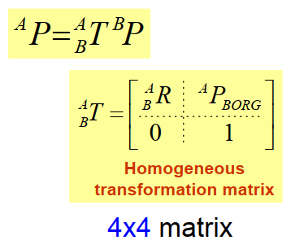
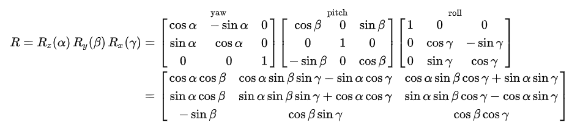
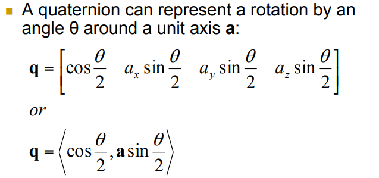
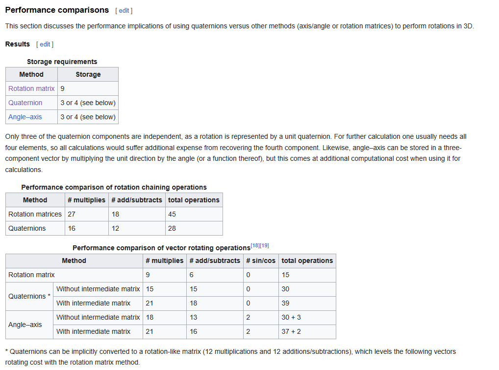
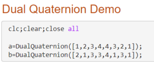
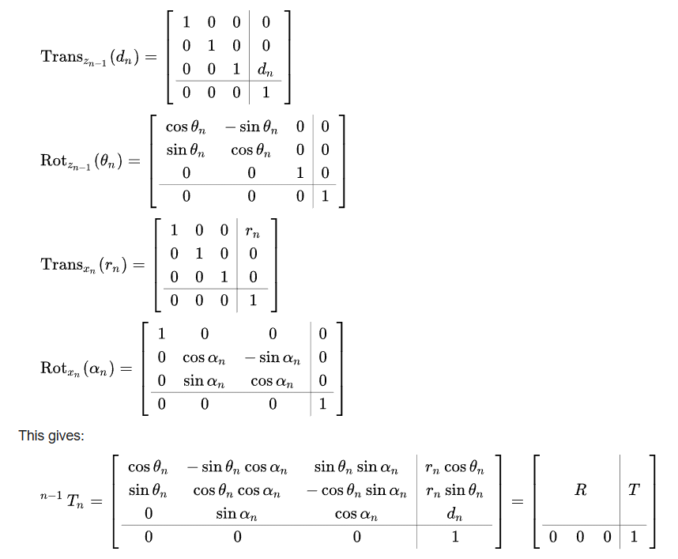
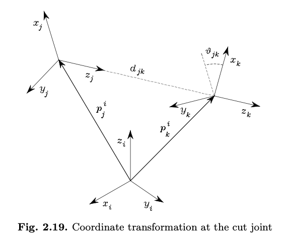
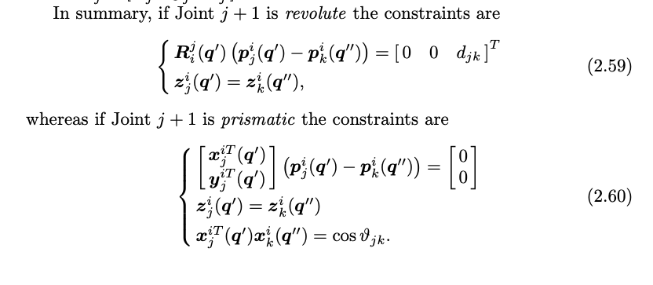

- Rigid body transformation = Rotation + Translation
  collapsed:: true
	- [Matrices and Transformation](https://www.youtube.com/watch?v=HgQzOmnBGCo)
	- Homogneous Matrix
		- 
		- Rotation matrix: common representation is Euler angles
			- {:height 185, :width 781}
			- Orthogonal Matrix: $R^T=R^{-1}$, $\text{det} R = \pm 1$
		- Quaternions
			- as alternative of rotation matrix
			- [Rotations, Orientation, and Quaternions - MATLAB & Simulink (mathworks.com)](https://www.mathworks.com/help/nav/ug/rotations-orientation-and-quaternions.html)
			- When to use: 3d rotation, avoid gimbal lock, if 1d or 2d just use Euler rotation
			- {:height 178, :width 363}
			- Quaternion definition in #matlab
			  collapsed:: true
				- ```Matlab
				  classdef Quaternion
				      % a Hamilton type (q0,q1,q2,q3) quaternion class
				      properties
				          v (1,4) % value of the quaternion
				      end
				      methods
				          %============================
				          function r=Quaternion(q)
				              % Initial the quaternion
				              r.v=q;
				          end
				          
				          %============================
				          function r=plus(q1,q2) 
				              % + operator
				              r=Quaternion(q1.v+q2.v);
				          end    
				          
				          %============================
				          function r=minus(q1,q2)
				              % - operator
				              r=Quaternion(q1.v-q2.v);
				          end
				          
				          %============================
				          function r=mtimes(q1,q2) 
				              % * opetator: support q*q and scalar*q
				              cq1=class(q1);
				              cq2=class(q2);
				              cq="Quaternion";
				              cd="double";
				              
				              % a*b
				              if cq1==cq && cq2==cq
				                  q10=q1.v(1);q1vec=q1.v(2:4);
				                  q20=q2.v(1);q2vec=q2.v(2:4);
				                  r0=q10*q20-q1vec*q2vec';
				                  rvec=q10*q2vec+q20*q1vec+cross(q1vec,q2vec);
				                  r=Quaternion([r0,rvec]);
				                  return
				              end
				              
				              % scalar times
				              if cq1==cd && cq2==cq
				                  r=Quaternion(q1*q2.v);
				                  return
				              end
				              if cq1==cq && cq2==cd
				                  r=Quaternion(q2*q1.v);
				                  return
				              end
				              
				          end
				          
				          %============================
				          function r=conj(q)
				              % Conjugate of the input quaternion
				              q0=q.v(1);qvec=q.v(2:4);
				              r=Quaternion([q0,-qvec]);
				          end
				          
				          %============================
				          function r=norm(q)
				               % Norm of the input quaternion
				              qc=q.conj;
				              r=q*qc;
				          end
				          
				          %============================
				          function r=normalize(q)
				              % Normalize the input quaternion
				              length=norm(q);
				              r=Quaternion(q.v/sqrt(length.v(1)));
				          end
				          
				          %============================
				          function r=cross(q1,q2)
				              % cross product
				              q10=q1.v(1);q1vec=q1.v(2:4);
				              q20=q2.v(1);q2vec=q2.v(2:4);
				              
				              rvec=q10*q2vec+q20*q1vec+cross(q1vec,q2vec);
				              r=Quaternion([0,rvec]);
				          end
				          
				          %============================
				          function r=vec(q)
				             % take the vector part of q
				             rv=q.v;
				             rv(1)=0;
				             r=Quaternion(rv);
				          end
				          
				          %============================
				          function r=times(q1,q2)
				              % dot product
				              r=(q1.conj*q2+q2.conj*q1)*(1/2);
				          end
				        
				          %============================
				          function rBA_Y=Qrotate(qYX,rBA_X)
				              % rBA_Y: rotate rBA_X use qYX
				              rBA_Y=qYX.conj*rBA_X*qYX;
				          end
				      end
				          
				  end
				  ```
			- Performance
			  collapsed:: true
				- 
	- Dual quaternion
		- dual quaternion = quaternion + dual number
		- 
		- dual quaternion in #matlab
		  collapsed:: true
			- ```Matlab
			  classdef DualQuaternion
			  % q= qr+e*qd
			  % qr: real part 
			  %     a Hamilton type (q0,q1,q2,q3) quaternion class
			  % qd: dual part
			  %     a Hamilton type (q4,q5,q6,q7) quaternion class
			  % q: (q0,q1,q2,q3,q4,q5,q6,q7)
			  properties
			          v (1,8) % all elements
			      end
			      methods
			          
			          %============================
			          function r=DualQuaternion(q)
			              % Initial the quaternion q is a (1,8) array /list
			              r.v=q;
			          end      
			          %============================
			          function rr=r(q)
			             % extract the real part of q
			             rr=Quaternion(q.v(1:4));
			          end
			          %============================
			          function rd=d(q)
			             % extract the dual part of q
			             rd=Quaternion(q.v(5:8));
			          end
			          %============================
			          function r=plus(q1,q2) 
			              % + operator
			              r=DualQuaternion(q1.v+q2.v);
			          end
			          %============================
			          function r=minus(q1,q2)
			              % - operator
			              r=DualQuaternion(q1.v-q2.v);
			          end  
			          %============================
			          function r=mtimes(q1,q2) 
			              % * opetator: support q*q and scalar*q
			              cq1=class(q1);
			              cq2=class(q2);
			              cq="DualQuaternion";
			              cd="double";
			              
			              % a*b
			              if cq1==cq && cq2==cq
			                  rr=q1.r*q2.r;
			                  rd=q1.r*q2.d+q1.d*q2.r;
			                  r=DualQuaternion([rr.v,rd.v]);
			                  return
			              end
			              
			              % scalar times
			              if cq1==cd && cq2==cq
			                  r=DualQuaternion(q1*q2.v);
			                  return
			              end
			              if cq1==cq && cq2==cd
			                  r=DualQuaternion(q2*q1.v);
			                  return
			              end
			              
			          end
			          
			          %============================
			          function r=conj(q)
			              % Conjugate of the input quaternion
			              rr=q.r.conj;
			              rd=q.d.conj;
			              r=DualQuaternion([rr.v,rd.v]);
			          end
			          
			          %============================
			          function r=swap(q)
			              % swap the real and dual part
			              r=DualQuaternion([q.d.v,q.r.v]);
			          end
			          
			          %============================
			          function r=cross(q1,q2)
			              % cross product            
			              rr=cross(q1.r,q2.r);
			              rd=cross(q1.d,q2.r)+cross(q1.r,q2.d);
			              
			              r=DualQuaternion([rr.v,rd.v]);
			          end
			          
			          %============================
			          function r=vec(q)
			             % take the vector of the q
			             rr=q.r.v;
			             rd=q.d.v;
			             rr(1)=0;
			             rd(1)=0;
			             r=DualQuaternion([rr,rd]);
			          end
			          
			          %============================
			          function r=times(q1,q2)
			              % dot product
			              r=(q1.conj*q2+q2.conj*q1)*(1/2);
			          end
			          %============================
			          function r=cdot(q1,q2)
			             % dual quaternion circle product
			             % ar.br+ad.bd         
			             rr=q1.r.*q2.r+q1.d.*q2.d;
			             rd=zeros(1,4);
			             r=DualQuaternion([rr.v,rd]);           
			          end
			              
			         
			          %============================
			          function r=normd(q)
			              % Norm of the input quaternion
			              r=q*q.conj;
			          end
			      
			          %============================
			          function r=norm(q)
			             r=cdot(q,q); 
			          end
			          %============================
			          function r=normalize(q)
			              % Normalize the input quaternion
			              rnormd=q.normd;
			              r=DualQuaternion(q.v/sqrt(rnormd.v(1)));
			          end
			          %============================
			          function rq=real(q)
			              % return the real quaternion of dual quaternion
			              rq=Quaternion(q.v(1:4));
			          end
			          %============================
			          function rq=dual(q)
			              % return the real quaternion of dual quaternion
			              rq=Quaternion(q.v(5:8));
			          end
			      end
			  end
			  ```
		- rigid body transformation with dual quaternion in #matlab
		  collapsed:: true
			- ```matlab
			  % t frame quaternion
			  qTE=QFromEuler(0,[0,0,1]); 
			  
			  qEI=QFromEuler(pi/4,[0,1,0]); %inclination
			  rEI=[0,0,0];
			  dqEI=DQFromQTvec(qEI,rEI);
			  
			  % new reference frame in t
			  TE_E = ReferFrame(rTE_E,wTE_E,vTE_E,aTE_E,aaTE_E,qTE);    
			  DT_T = ReferFrame(rDT_T,wDT_T,vDT_T,aDT_T,aaDT_T,qDT);
			  
			  %frame T in frame I        
			  rTI_I_dq = dqEI * TE_E.rdq * dqEI.conj;
			  rTI_I_v  = rTI_I_dq.v(2:4);
			  
			  % frame D in frame I
			  dqTI = dqEI * TE_E.dq;
			  rDT_I_dq = dqTI * DT_T.rdq * dqTI.conj;
			  rDT_I_v=rDT_I_dq.v(2:4); % x axis vector
			  
			  function r=QFromEuler(theta,n)
			      % build the quaternion with (cos(theta/2),sin(theta/2)*n)
			      % where n is a vector
			      if isequal(size(n),[3,1])
			          n=n'; % 1x3
			      end
			      n=n/norm(n); %normalize the rotate axis vector
			      q=[cos(theta/2), sin(theta/2)*n];
			      r=Quaternion(q);
			  end
			  
			  function rdq=DQFromQTvec(qYX,tYX_X)
			     % build a dual quaternion from quaternion and translation vector
			     % qYX: quaternion, or translation, ep. from reference frame D to B = qBD
			     % tYX_X: translation vector, seen in the frame D = tBD_D
			     t_quaternion = Quaternion([0,tYX_X]);
			     rr = qYX;
			     rd = (t_quaternion*qYX)*(1/2);
			     rdq = DualQuaternion([rr.v, rd.v]);
			  end
			  ```
- DH Parameters
  collapsed:: true
	- [Denavit–Hartenberg parameters - Wikipedia](https://en.wikipedia.org/wiki/Denavit%E2%80%93Hartenberg_parameters)
	- 
		- *d*: offset along previous *z* to the common normal
		- *θ*: angle about previous *z*, from old *x* to new *x*
			- 
		- *r*: length of the common normal (aka *a*, but if using this notation, do not confuse with *α*). Assuming a revolute joint, this is the radius about previous *z*.
		- *α*: angle about common normal, from old *z* axis to new *z* axis
	- {:height 465, :width 550}
- Forward Kinematics & Inverse Kinematics
	- 
	- [Forward and Inverse Kinematics Code in Github](https://github.com/Kexin-Wei/Robotics_demo)
	- Forward Kinematics: given known DoFs, the end effector is defined
		- ![[T]={}^{{0}}T_{n}=\prod _{{i=1}}^{n}{}^{{i-1}}T_{i}(\theta _{i}),](https://wikimedia.org/api/rest_v1/media/math/render/svg/db41854357836e8b97260b217048122712eef46e)
	- Inverse Kinematics: given known end effector pose (T / euler + position / quaternion ), DoFs values are calculated
		- assume end effector pose is $T_{end}$
		- then $T=T_{end}$ check for all the matrix elements, e.g., $T[0][0] = T_{end}[0][0]$
		- solve it numerically or analytically depend on the application situation
- Parallel Robot
	- 
	- 
- Python Package for Kinematics #software
	- [moble/quaternionic: Interpret numpy arrays as quaternionic arrays with numba acceleration (github.com)](https://github.com/moble/quaternionic): evolved from the [quaternion](https://github.com/moble/quaternion) package, numpy adaptive
	- [quaternion](https://github.com/moble/quaternion/) (core written in C; very fast; adds quaternion `dtype` to numpy; named [numpy-quaternion](https://pypi.org/project/numpy-quaternion/) on pypi due to name conflict)
	- [clifford](https://github.com/pygae/clifford) (very powerful; more general geometric algebras)
	- [rowan](https://github.com/glotzerlab/rowan) (many features; similar approach to this package; no acceleration or overloading)
	- [pyquaternion](http://kieranwynn.github.io/pyquaternion/) (many features; pure python; no acceleration or overloading)
	- [quaternions](https://github.com/mjsobrep/quaternions) (basic pure python package; no acceleration; specialized for rotations only)
	- [scipy.spatial.transform.Rotation.as_quat](https://docs.scipy.org/doc/scipy/reference/generated/scipy.spatial.transform.Rotation.as_quat.html) (quaternion output for `Rotation` object)
	- [mathutils](https://gitlab.com/ideasman42/blender-mathutils) (a Blender package with python bindings)
	- [Quaternion](https://pypi.org/project/Quaternion/) (extremely limited capabilities; unmaintained)
	- Also note that there is some capability to do symbolic manipulations of quaternions in these packages:
		- [galgebra](https://github.com/pygae/galgebra) (more general geometric algebras; analogous to `clifford`, but for symbolic calculations)
		- [sympy.algebras.quaternion](https://docs.sympy.org/latest/modules/algebras.html)