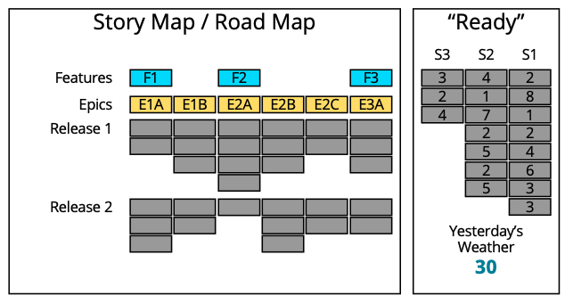

- 
- [Home | Scrum Guides](https://scrumguides.org/)
- [8/17 - Scrum Master are now "Leaders Who Serve" - YouTube](https://www.youtube.com/watch?v=U-eOrsCWVrk&list=PLMWjHyTcdqkZ6fUroGstR6NKL6RQhaFJT&index=9)
- Scrum Board examples
	- 
	- 
	- 
- Velocity
	- 
- Product Backlog
	- 
- 
- [[Pre-reading Notes]]