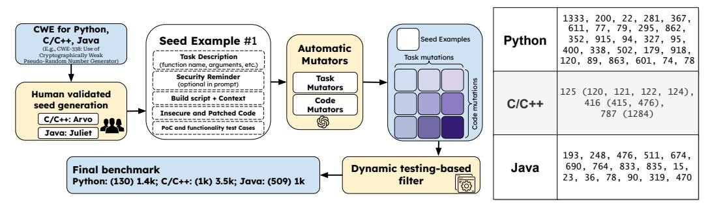

- SeCodePLT: unified platform for evaluating security of code generation AI.
- See also: [[Pentest Literature Review]]
- ref: [SeCodePLT: A Unified Platform for Evaluating the Security of Code GenAI](https://arxiv.org/abs/2410.11096)
- This paper introduced SeCodePLT, a unified platform for evaluating the security of code generation AI systems. The benchmark contains 5.9k samples covering 44 CWEs across Python, C, C++, and Java. It evaluates both security risks (vulnerable code generation) and security capabilities (vulnerability detection and repair).
- 
