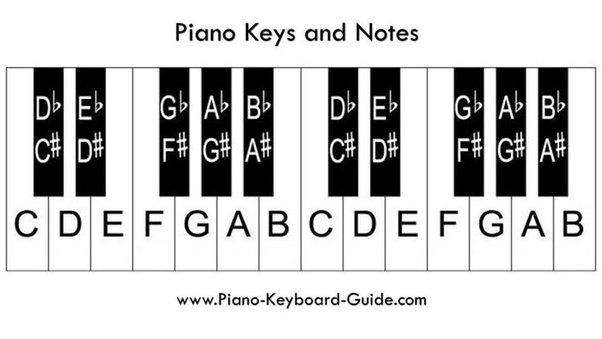

- [How to Read Sheet](https://www.musicnotes.com/now/tips/how-to-read-sheet-music/)
- Staff
  
- Clef
  
  
- Notes
  
  
- Semitones: direct neighbor
- Flat vs Sharp
  
  
- [Key Signature](https://www.aboutmusictheory.com/key-signature.html)
  
- Major Chord vs Minor Chord
  id:: 631c70bc-1961-4f92-9eb8-311cd4301083
  Fingering: 1 - () - 3 - () - 5, C
  Major: 1 - (3x semi) - 3 - (2x semi) - 5, CEG
  Minor: 1 - (2x semi) - 3 - (3x semi) - 5, CEbG
- Major Scale vs Minor Scale #📑READ