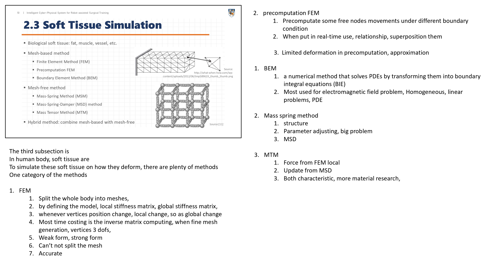

- 
- Biomedical Model
	- MSM Mass Spring Method
	- FEM Finite Element Method
- Statistical Model
	- training data, so can real-time
- [Fast Volume-Preserving Free Form Deformation](http://gamma.cs.unc.edu/FFD/)
-