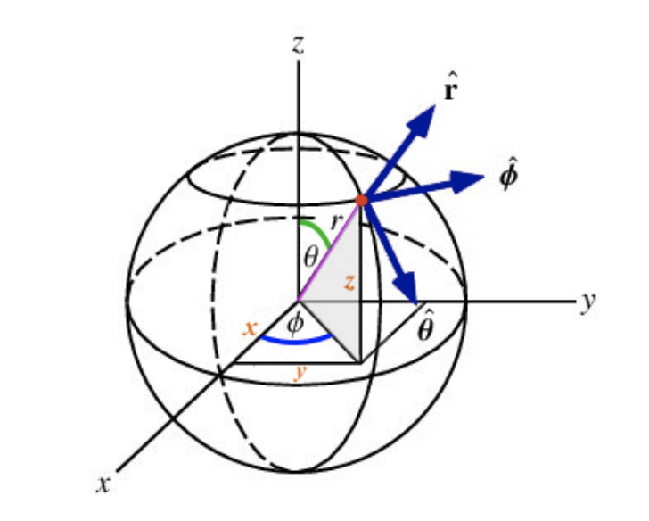
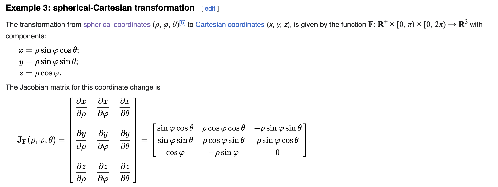

- https://en.wikipedia.org/wiki/Spherical_coordinate_system#Coordinate_system_conversions
- Definition
	- {:height 217, :width 246}
- [Unit Vector](https://en.wikipedia.org/wiki/Unit_vector)
	- How to get Unit Vector in Spherical Coordinate
		- Method 1: Geo 
		- Method 2: Algebra 
	- Unit Vector transformation - [Jacobian](https://en.wikipedia.org/wiki/Jacobian_matrix_and_determinant)
	- {:height 265, :width 686}
- [Orthogonal Matrix](https://en.wikipedia.org/wiki/Orthogonal_matrix)