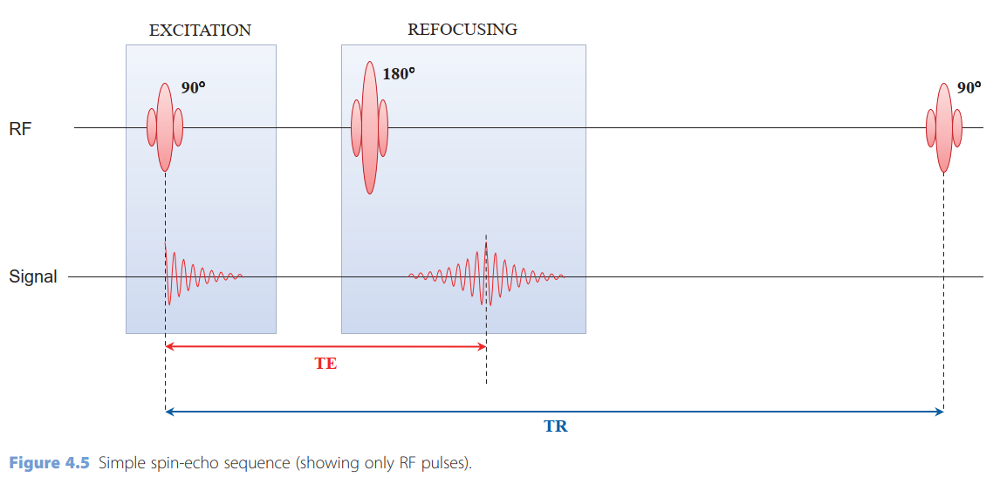
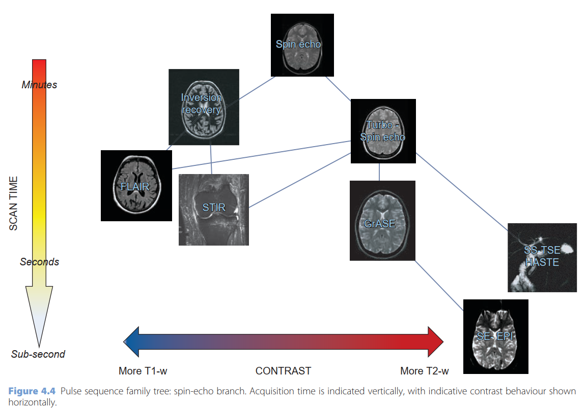
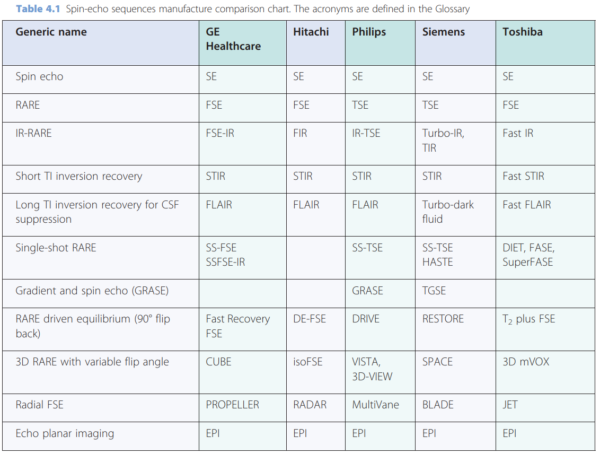
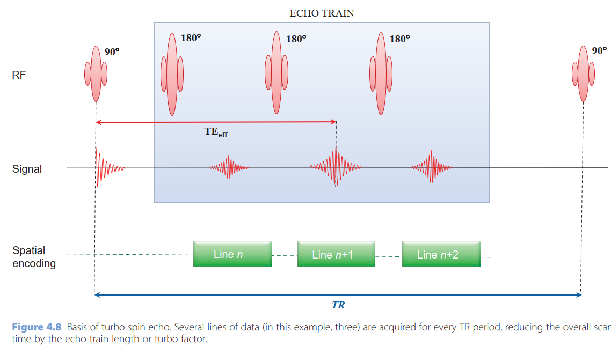

- 
- 
- 
- In terms of increasing speed and complexity the spin-echo branch of the family contains Turbo or Fast Spin Echo (TSE/FSE), turbo GRadient And Spin Echo (GRASE), single-shot TSE or HAlf-Fourier Single-shot Turbo spin Echo (HASTE) and Spin-Echo Echo Planar Imaging (SE-EPI).
- Others spin echo include FLuid Attenuated Inversion Recovery (FLAIR) and Short TI Inversion Recovery (STIR).
- In Turbo or Fast Spin Echo (TSE, FSE), multiple signal echoes are collected following each excitation pulse
	- 