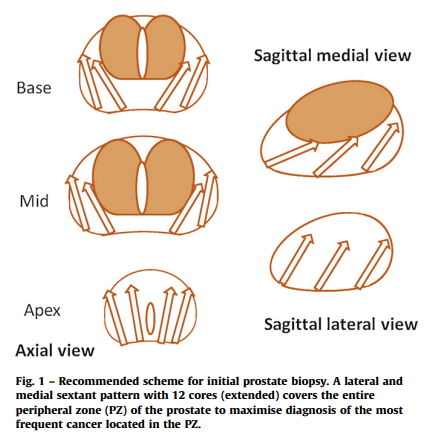

- Template: [mentioned by AUA](https://www.auanet.org/guidelines-and-quality/guidelines/early-detection-of-prostate-cancer-guidelines)
	- Current (2023) most common biopsy scheme: 10/12 core Sextant
	- standard sextant scheme 5 region: [Diagnostic Value of Systematic Biopsy Methods in the Investigation of Prostate Cancer: A Systematic Review | Journal of Urology (auajournals.org)](https://www.auajournals.org/doi/abs/10.1016/S0022-5347(05)00957-2)
	- 
	- [Contemporary Role of Systematic Prostate Biopsies: Indications, Techniques, and Implications for Patient Care - ScienceDirect](https://www.sciencedirect.com/science/article/abs/pii/S0302283812011013?via%3Dihub)
		- 
		- 
	- [Extended Peripheral Zone Biopsy Schemes Increase Cancer Detection Rates and Minimize Variance in Prostate Specific Antigen and Age Related Cancer Rates: Results of a Community Multi-Practice Study | Journal of Urology (auajournals.org)](https://www.auajournals.org/doi/10.1016/S0022-5347%2805%2964051-7)
		- 
	- [Free-hand transperineal prostate biopsy provides acceptable cancer detection and minimizes risk of infection: evolving experience with a 10-sector template - ScienceDirect](https://www.sciencedirect.com/science/article/abs/pii/S1078143918303545?via%3Dihub)
		- 
	- [Full article: Cancer detection rates of different prostate biopsy regimens in patients with renal failure (tandfonline.com)](https://www.tandfonline.com/doi/full/10.3109/0886022X.2014.915195)
		- 
- China
  collapsed:: true
	- {:height 441, :width 804}
	- {:height 825, :width 386}
	  id:: 65094e5f-9ada-4b9e-b00e-6ac2133f0e4e
	- Transrectal: 6 / 10 / 12 / 13 Core
		- {:height 328, :width 337}
		- {:height 341, :width 340}
	- Transperineal: 10 / 12 / saturated
		- {:height 344, :width 364}
		- 
- Singapore
  collapsed:: true
	- A 2006 systematic review showed that 12 is the minimum number of cores for systematic biopsies, with > 12  cores not increasing cancer detection rate significantly
	- Additional cores should be obtained from suspect areas identified by DRE or on pre-biopsy MRI; multiple cores  (3–5) should be taken from each MRI-visible lesion
	- 
- American
  collapsed:: true
	- A systematic biopsy should include a minimum of 12 cores, distributed throughout the prostate, with thorough sampling of the peripheral zone. ((650d3be0-1f49-4cc9-9ab7-c02241460ec2))
	- In performing a biopsy, these goals appear to be best achieved through a 12-core systematic sampling methodology that incorporates apical and far-lateral cores in the template distribution. ((650d3bef-63ab-4b5d-9387-5298e5290279))
	- The NCCN panel suggests an “extended-pattern 12-core biopsy” that includes the standard sextant; peripheral base, mid-gland, and apex; and lesion-directed palpable nodules or suspicious images.
	- The other panels do not specify the regions of the prostate to sample, although the Italian panel recommends biopsy protocols directed to the peripheral-lateral zone.
	- Only the Italian guidelines address biopsy specimen labeling with a recommendation to package biopsy specimens from different sides and different areas (e.g., base, mid-gland, and apex) in separate containers; however, core specimens from the same area should be packaged in the same container.
	- This group also suggests that specimens from different sides and areas be labeled and that no more than two or three specimens be placed in the same container.
- Reference:
	- [介入超声系列（TRUS引导下前列腺穿刺） (qq.com)](https://mp.weixin.qq.com/s/Q76QR_AMqeIV0kizW_b7gg)
	- [关注“前列县”---前列腺穿刺技术 (qq.com)](https://mp.weixin.qq.com/s/4RUK1rfSuXwmIHImohNJXQ)
	- [病例分享 | 一例改良同轴针法经会阴前列腺穿刺活检分享 (qq.com)](https://mp.weixin.qq.com/s/K17ges2gtPrwPc3562btnQ)
	- [直肠介入超声下前列腺改良12+X穿刺活检及系统穿刺活检与前列腺癌术后Gleason评分的一致性 (qq.com)](https://mp.weixin.qq.com/s/j7IjhbdPPE7aKr72FgR7TA)
	- [【指南与共识】前列腺穿刺中国专家共识(2022年版) (qq.com)](https://mp.weixin.qq.com/s/RQuRIoKy2AUWUPhdbYFMOQ)
	- [EAU-EANM-ESTRO-ESUR-ISUP-SIOG-Guidelines-on-Prostate-Cancer-2023_2023-06-13-141145.pdf (d56bochluxqnz.cloudfront.net)](https://d56bochluxqnz.cloudfront.net/documents/full-guideline/EAU-EANM-ESTRO-ESUR-ISUP-SIOG-Guidelines-on-Prostate-Cancer-2023_2023-06-13-141145.pdf)
	- [Guidelines - Singapore Urological Association (sua.sg)](https://sua.sg/guidelines/)
	- [Early Detection of Prostate Cancer: AUA/SUO Guideline (2023) - American Urological Association (auanet.org)](https://www.auanet.org/guidelines-and-quality/guidelines/early-detection-of-prostate-cancer-guidelines)
	  id:: 650d3be0-1f49-4cc9-9ab7-c02241460ec2
	- [Optimal Techniques of Prostate Biopsy and Specimen Handling - American Urological Association (auanet.org)](https://www.auanet.org/guidelines-and-quality/quality-and-measurement/quality-improvement/clinical-consensus-statement-and-quality-improvement-issue-brief-(ccs-and-qiib)/prostate-biopsy-and-specimen-handling)
	  id:: 650d3bef-63ab-4b5d-9387-5298e5290279
	- Eichler K, Hempel S, Wilby J et al: Diagnostic value of systematic biopsy methods in the investigation of prostate cancer: A systematic review. J Urol 2006; 175: 1605
	- Ristau BT, Allaway M, Cendo D et al: Free-hand transperineal prostate biopsy provides acceptable cancer detection an
	- Ukimura O, Coleman JA, de la Taille A et al: Contemporary role of systematic prostate biopsies: Indications, techniques, and implications for patient care. Eur Urol 2013; 63: 214
	- Presti JC, Jr., O'Dowd GJ, Miller MC et al: Extended peripheral zone biopsy schemes increase cancer detection rates and minimize variance in prostate specific antigen and age related cancer rates: Results of a community multi-practice study. J Urol 2003; 169: 125
	- Hoşcan, Mustafa Burak, et al. "Cancer detection rates of different prostate biopsy regimens in patients with renal failure." *Renal Failure* 36.6 (2014): 895-898.