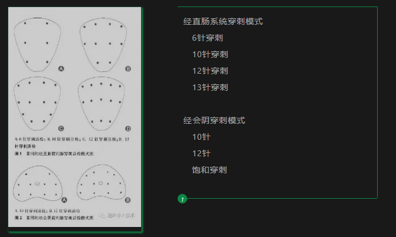
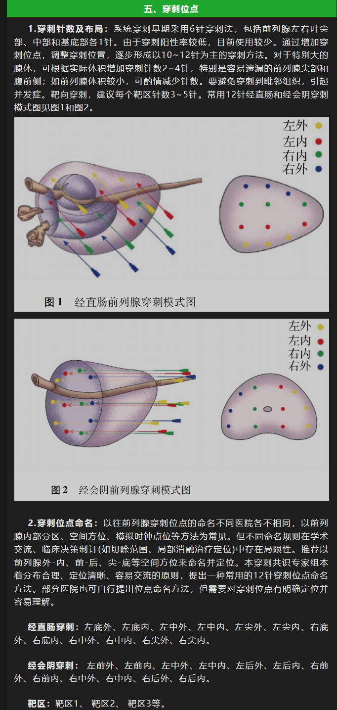
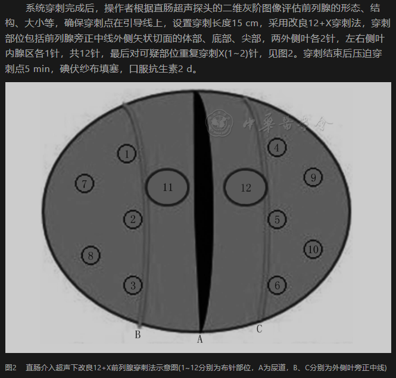
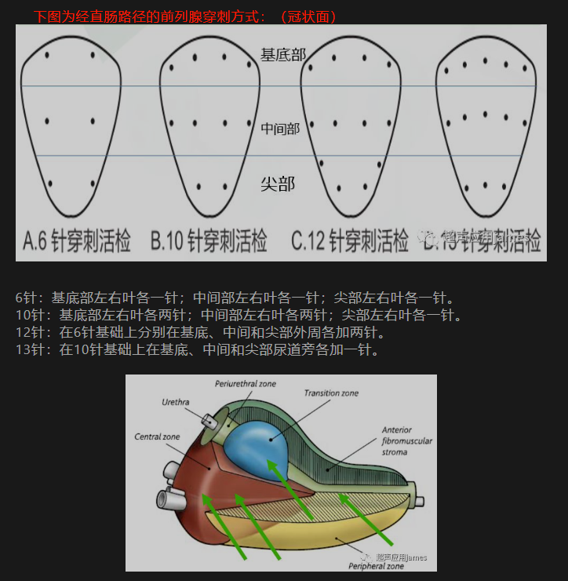
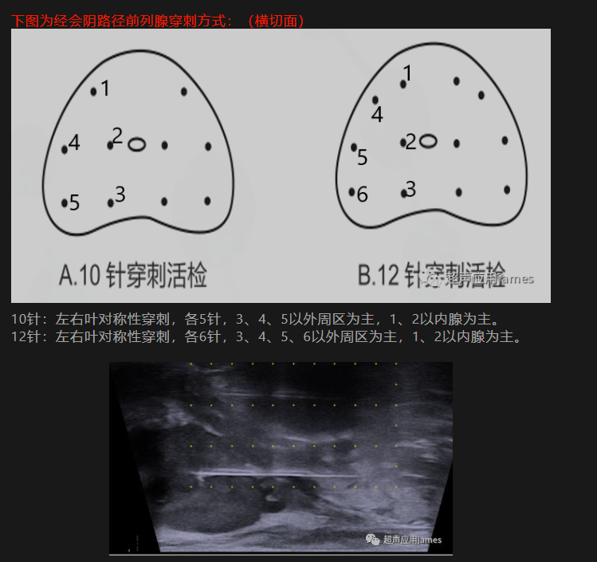
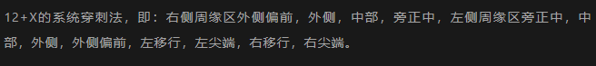

- {:height 410, :width 671}
- 
  id:: 65094e5f-9ada-4b9e-b00e-6ac2133f0e4e
- Transrectal: 6 / 10 / 12 / 13 Core
	- 
	- 
- Transperineal: 10 / 12 / saturated
	- 
	- 
- Current (2023) most common biopsy scheme: 10/12 core Sextant
- Reference:
	- [介入超声系列（TRUS引导下前列腺穿刺） (qq.com)](https://mp.weixin.qq.com/s/Q76QR_AMqeIV0kizW_b7gg)
	- [关注“前列县”---前列腺穿刺技术 (qq.com)](https://mp.weixin.qq.com/s/4RUK1rfSuXwmIHImohNJXQ)
	- [病例分享 | 一例改良同轴针法经会阴前列腺穿刺活检分享 (qq.com)](https://mp.weixin.qq.com/s/K17ges2gtPrwPc3562btnQ)
	- [直肠介入超声下前列腺改良12+X穿刺活检及系统穿刺活检与前列腺癌术后Gleason评分的一致性 (qq.com)](https://mp.weixin.qq.com/s/j7IjhbdPPE7aKr72FgR7TA)
	- [【指南与共识】前列腺穿刺中国专家共识(2022年版) (qq.com)](https://mp.weixin.qq.com/s/RQuRIoKy2AUWUPhdbYFMOQ)