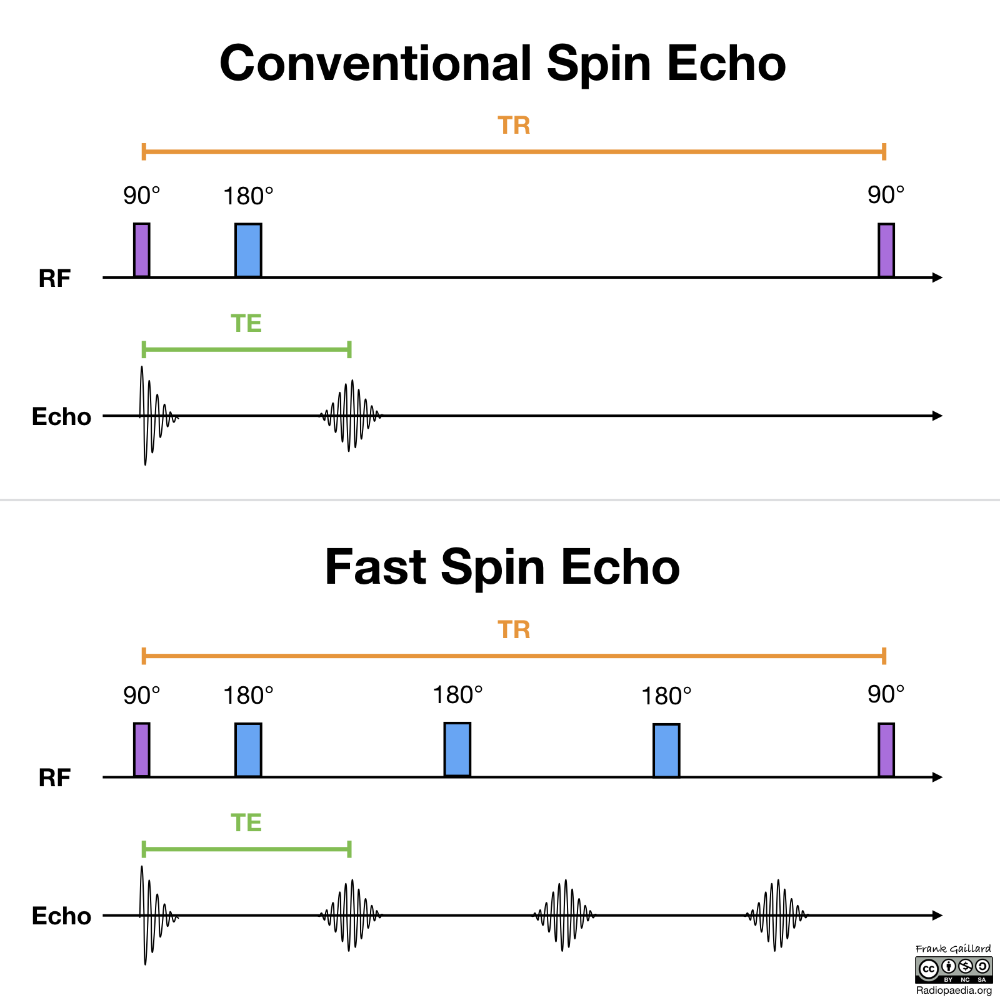

- 
- Mechanism
	- {{video https://youtu.be/ALRcr-AjRK4}}
- T2w contrast can be produced by either Spin-Echo (SE) or some Gradient-Echo (GE) sequences. (GE sequences actually produce T2*-weighting, not T2-weighting: the image appearance is similar, but there are important differences which we will explain later.)
- Actual T2W used in Hospital
	- | File Name Patterns | Appear times | Meaning |
	  | Unique name | Sum occur |  |
	  | t2_tse_fs_tra | 56 | Turbo spin echo, Fast spin echo |
	  | t2_tse_fdixon_tra_p2_256_w | 26 | Turbo spin echo, Dixon, 2mm slice, 256x256 size |
	  | t2w_spair_ax | 25 | Spair |
	  | t2_tse_fdixon_tra_p2_256_in | 19 | Turbo spin echo, Dixon, 2mm slice, 256x256 size, inverted version |
	  | t2_tse_fdixon_tra_p2_256_opp | 13 | Turbo spin echo, Dixon, opposite-phase version |
	  | t2_tse_tra | 13 | Turbo spin echo |
	  | et2w_tse_axclear | 9 | clear |
	  | t2 | 8 |  |
	  | t2_tse_fdixon_tra_p2_256_f | 7 | Turbo spin echo, Dixon, 2mm slice, 256x256 size, Fast spin echo |
	  | t2_tse_tra_p2-4mm-wwp_fil | 6 | Turbo spin echo, 2-mm slice thickness, 4-mm slice gap, and water-excitation pulse. |
	  | axt2 | 5 |  |
	  | axfst2 | 3 |  |
	  | axt2propeller | 3 |  |
	  | et2w_spairsense | 3 |  |
	  | osagt2fseshim | 3 |  |
	  | t2_tse_tra_320 | 3 |  |
	  | et2w_spair_tra | 2 |  |
	  | t2_tse_fs_tra_320_p2 | 2 |  |
	  | et2w_tse_ax_hr | 1 |  |
	  | t2-h | 1 |  |
- ((643de787-0b12-4dfb-9890-4056d96d7a3f))
- [Fat suppression methods - Questions and Answers ​in MRI (mriquestions.com)](https://mriquestions.com/best-method.html)
	- **Chemical-shift Techniques**
		- **In-Phase/Out-of-Phase Imaging**
		- **Dixon Technique(s)**
		- **CHESS (Fat-Sat)**
		- **Water Excitation**
	- **Technique Based on Short T1 of Fat**
		- **Short TI Inversion Recovery (STIR)**.
	- **Hybrid Techniques**
		- **SPIR and SPAIR**
- Spin Echo
	- SE T2 images require long TR and long TE, so they have a long scan time (this is because the scan time depends directly on the TR).
	- Low signal for fat
- Fast Spin Echo / Turbo Spin Echo
	- fat will have a high signal
	- {:height 641, :width 658}
- Spair
	- selectively null the signal from fat tissue
	- 
	- 
- Dixon
	- The Dixon method for fat/water separation is widely used to obtain uniform fat suppression using the water-only reconstruction.
	- It will generate 4 images
	- 
	- 
- ((643f4d74-12c8-40d4-9da5-dabdab4e7a10))