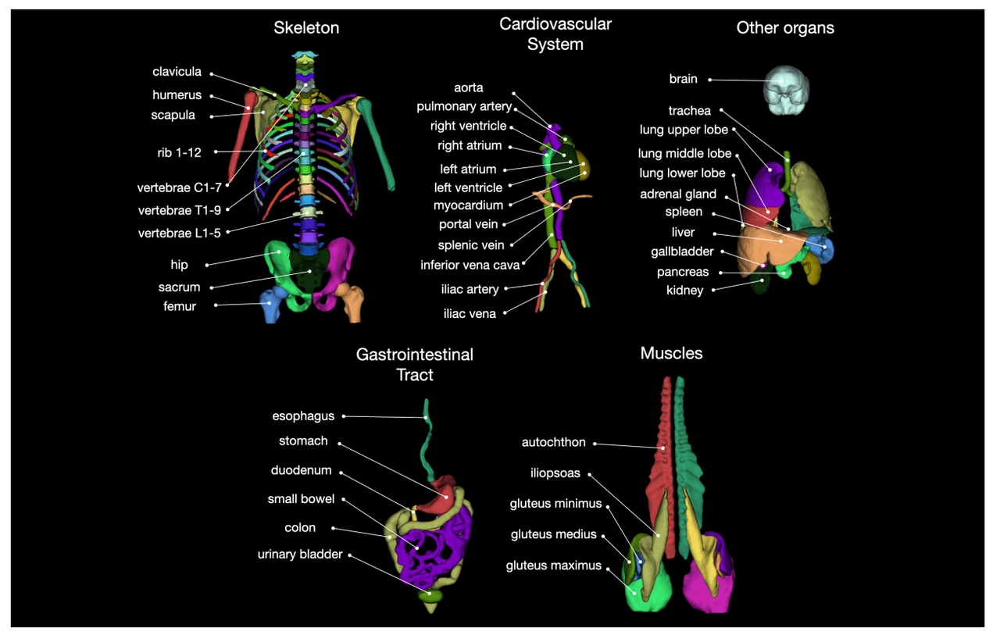
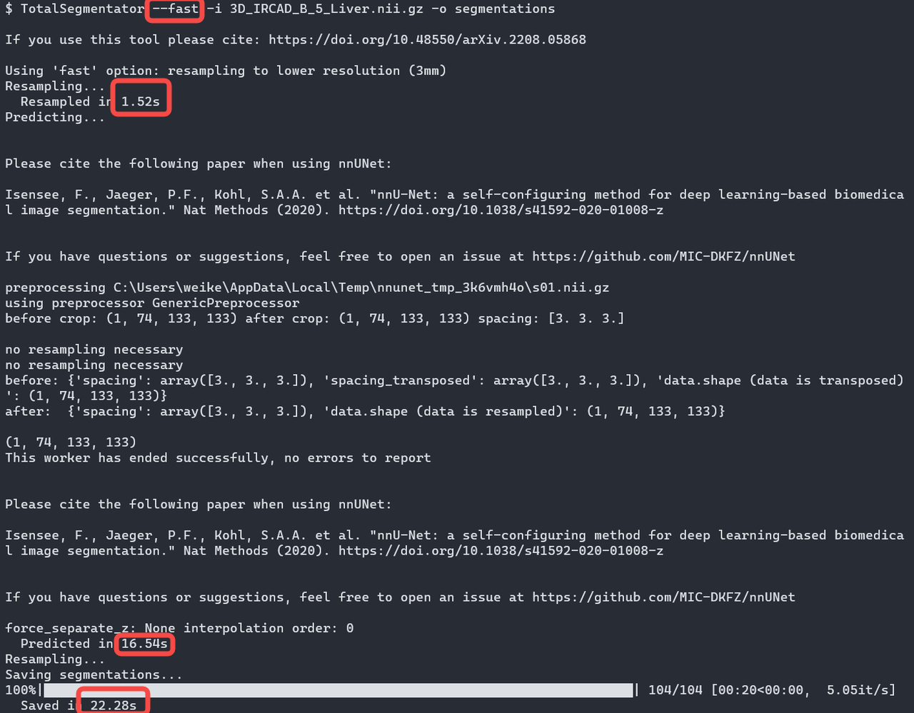

- [TotalSegmentator](https://github.com/wasserth/TotalSegmentator)
- Supported segmentation parts
	- 
- Follow the installation instructions at https://github.com/wasserth/TotalSegmentator to install python and pytorch, and finally pip install TotalSegmentator
	- Other advanced setting
	  _1684485796299_0.PNG)
	- To get --roi_subset option, follows the description in here
	  _1684485840113_0.PNG)
- Running test: provide .nii.gz format CT image, it will generate segmentation result (all in .nii.gzformat) in segmentations folders (user defined) with all supported parts as follows.
	- .nii.gz is supported in ITK 5.1,check itk::NiftiImageIO Class Reference for more official reference. An example can be found here.
	  collapsed:: true
		- _1684485858696_0.PNG)
		- _1684485863154_0.PNG)
- Running speed test (in CPU and GPU)
	- Official test result
	  _1684485919960_0.png)
- Fast: CPU 1min (predict+resample+35s), GPU 1min (predict+resample 15s) for file MainCT_.mha MainCT_.mha (512x512x312)
	- _1684485959074_0.png)
	- _1684485969122_0.png)
- Fast CPU 42s, GPU 40s for file 3D_IRCAD_B_5_Liver.nii.gz (512x512x139)
	- Non fast: CPU>10min, GPU 2min15s
		- 