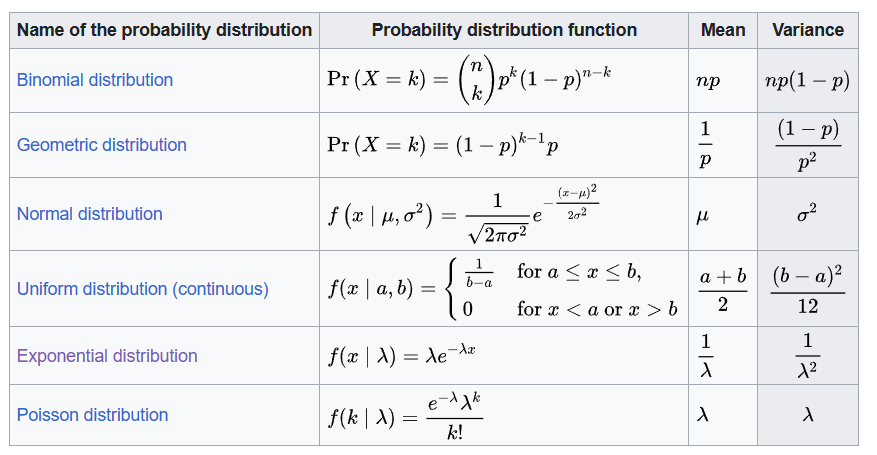

- [Variance - Wikipedia](https://en.wikipedia.org/wiki/Variance)
- $\sigma^2, s^2, \operatorname{Var}(X), V(X), \text { or } \mathbb{V}(X)$
- $\operatorname{Var}(X)=\mathrm{E}\left[(X-\mu)^2\right] = \operatorname{Cov}(X,X)$ [[Covariance]]
- $\begin{aligned} \operatorname{Var}(X) & =\mathrm{E}\left[(X-\mathrm{E}[X])^2\right] \\ & =\mathrm{E}\left[X^2-2 X \mathrm{E}[X]+\mathrm{E}[X]^2\right] \\ & =\mathrm{E}\left[X^2\right]-2 \mathrm{E}[X] \mathrm{E}[X]+\mathrm{E}[X]^2 \\ & =\mathrm{E}\left[X^2\right]-\mathrm{E}[X]^2\end{aligned}$
- $\operatorname{Var}(X)=\sum_{i=1}^n p_i \cdot\left(x_i-\mu\right)^2$
	- $\mu=\sum_{i=1}^n p_i x_i$
- $\operatorname{Var}(X)=\int_{\mathbb{R}} x^2 f(x) d x-\mu^2$
	- $\mu=\int_{\mathbb{R}} x f(x) d x=\int_{\mathbb{R}} x d F(x)$
- Commonly used probability distributions
	- 