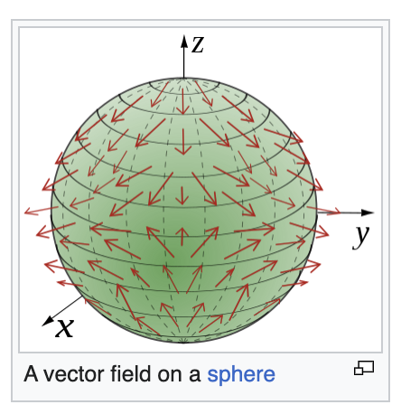
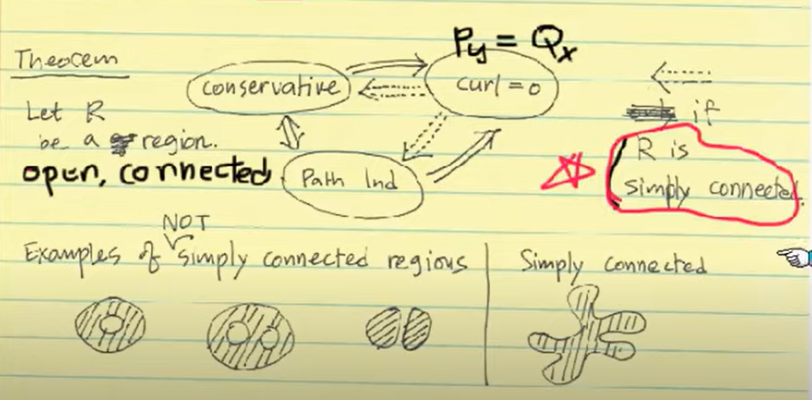
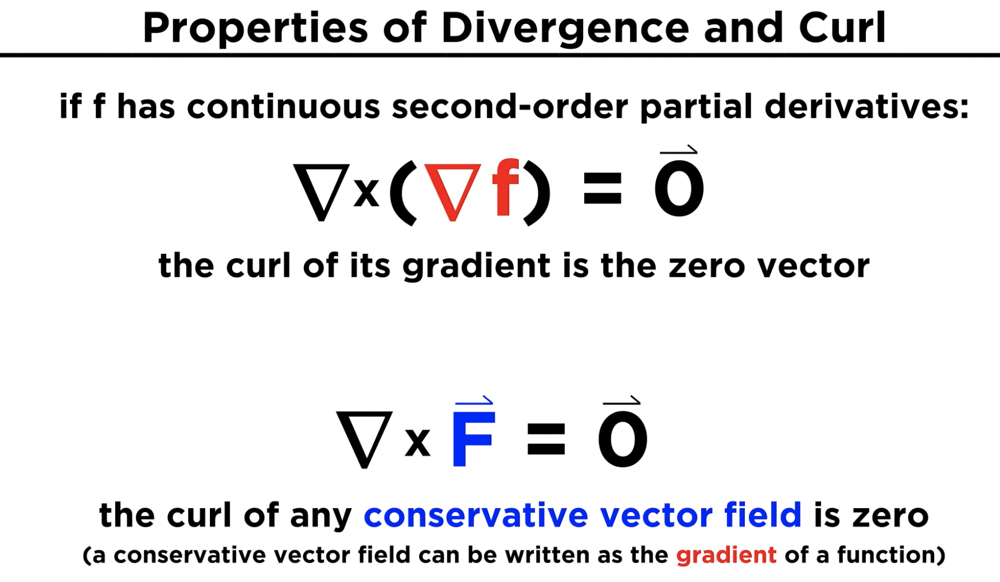

- Explore introductory materials:
	- https://math.libretexts.org/Bookshelves/Calculus/Calculus_(OpenStax)/16%3A_Vector_Calculus/16.01%3A_Vector_Fields
- Definition
	- every smooth vector field $V$ on an open subset $S$ of ${\mathbf {R} }^{n}$can be written as $$\sum_{i=1}^n V_i\left(x_1, \ldots, x_n\right) \frac{\partial}{\partial x_i}$$
	- {:height 305, :width 294}
- Gradient Fields
	- Conservative field
	- important in Physics
	- $$
	  \operatorname{grad} f=\nabla f=f_x(x, y, z) \mathbf{i}+f_y(x, y, z) \mathbf{j}+f_z(x, y, z) \mathbf{k}
	  $$
		- $f$ is called a potential function for F
	- The Cross-Partial Property of Conservative Vector Fields
		- if $$ \mathbf{F}(x, y, z)=\langle P(x, y, z), Q(x, y, z), R(x, y, z)\rangle $$ is a conservative field in R3, then
		- $$
		  \frac{\partial P}{\partial y}=\frac{\partial Q}{\partial x}, \frac{\partial Q}{\partial z}=\frac{\partial R}{\partial y}, \text { and } \frac{\partial R}{\partial x}=\frac{\partial P}{\partial z}
		  $$
- Vector Field Properties
	- {{video https://www.youtube.com/watch?v=Q_tdnTtXwu4}}
	- Conservative or Not
		- Requirement: Open and Connected Region R
		- $F(x,y)$ is conservative on R, if scalar function $f(x,y)$ s.t.t $\nabla f =F$
		- $\int_C F \cdot dr$ is path-independent, if $\int_{C_1} F \cdot dr =  \int_{C_2} F \cdot dr$ for all curves
		- For $F(x,y) = <P,Q>$, F has zero-curl on R, if $curl (F)=P_y-Q_x$ on R
		- {:height 248, :width 489}
	- [6.1 Vector Fields - Calculus Volume 3 | OpenStax](https://openstax.org/books/calculus-volume-3/pages/6-1-vector-fields)
- Vector field operations
	- Line Integral
		- $\int_\gamma V(\mathbf{x})\cdot d \mathbf{x} = \int^{b}_{a} V(\gamma(t))\cdot \dot \gamma(t) dt$
	- Divergence
		- $\text{div} \mathbf{F} = \nabla \cdot \mathbf{F} = \frac{\partial F_1}{\partial x} + \frac{\partial F_2}{\partial y} + \frac{\partial F_3}{\partial z}$
	- Curl
		- $\text{crul} \mathbf{F} = \nabla \times \mathbf{F} = \left( \frac{\partial F_3}{\partial y} - \frac{\partial F_2}{\partial z} \right)\mathbf{e}_1 - \left( \frac{\partial F_3}{\partial x} - \frac{\partial F_1}{\partial z} \right)\mathbf{e}_2 + \left( \frac{\partial F_2}{\partial x} - \frac{\partial F_1}{\partial y} \right)\mathbf{e}_3$
		  id:: 644e57fa-4d8d-4f8f-8d2a-dbe7909ce8d9
	- Index
		- 
- Study applications of vector fields
	- Fluid flow and aerodynamics
	- Electromagnetic fields
	- Gravitational fields
	- Deformation and stress analysis in materials
- Solve problems and practice:
	- 
- In other coordinates, spherical coordinates, cylindrical coordinates
	- https://en.wikipedia.org/wiki/Del_in_cylindrical_and_spherical_coordinates
- Explore advanced topics (optional)
  If you want to dive deeper into vector fields, consider studying more advanced topics like differential forms, differential geometry, or tensor analysis.
- More References
	- Multivariable Calculus" by James Stewart
	- "Vector Calculus" by Jerrold E. Marsden and Anthony J. Tromba
	- Khan Academy's multivariable calculus course (free online)
	- MIT OpenCourseWare's multivariable calculus course (free online)
	- [6.1 Vector Fields - Calculus Volume 3 | OpenStax](https://openstax.org/books/calculus-volume-3/pages/6-1-vector-fields) repeated