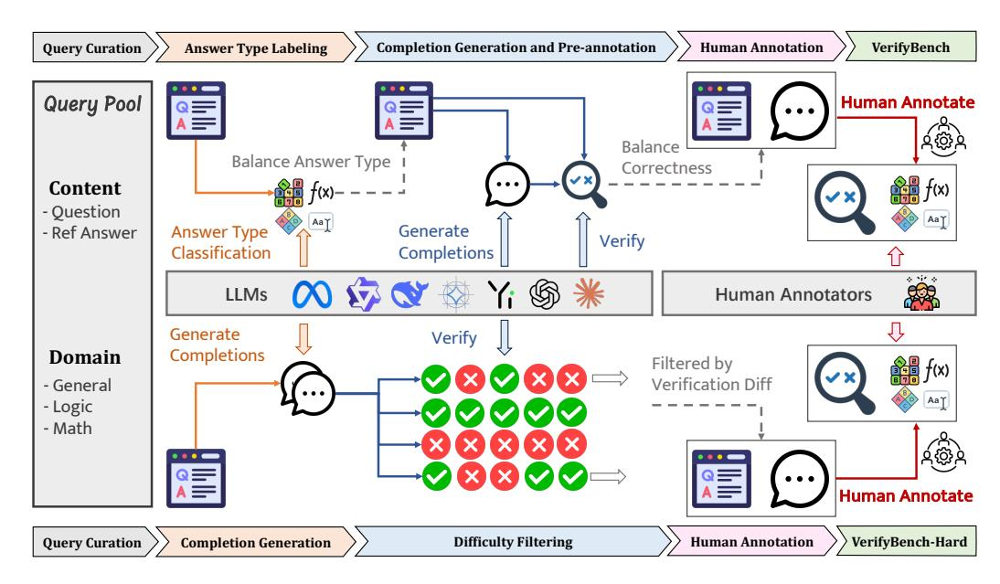

- VerifyBench: benchmark for reference-based reward systems for LLMs in reasoning tasks.
- See also: [[Pentest Literature Review]]
- for reasoning
- [VerifyBench: Benchmarking Reference-based Reward Systems for Large Language Models](https://arxiv.org/abs/2505.15801)
- This paper presented VerifyBench, a benchmark for evaluating reference-based reward systems for LLMs in reasoning tasks. It focuses on measuring how well reward models can verify LLM outputs against reference solutions.
- 
