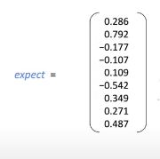
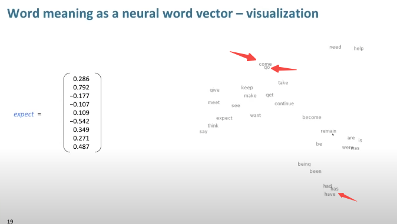

- distributed representation, dense vector
- Distributional semantics: a theoretical framework in linguistics and natural language processing (NLP) that focuses on the idea that the meaning of words can be inferred from their distribution in context.
- 
- Similar words locate closer
  
- [[Word2vec]]