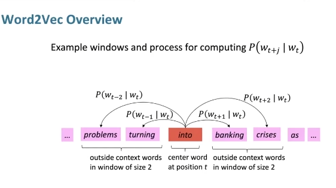
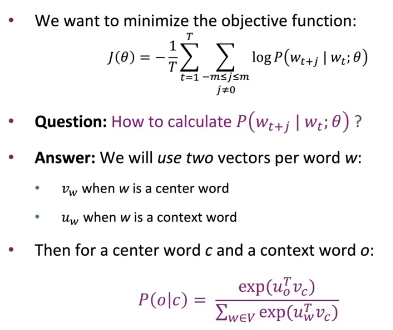

- uses a neural network-based approach to learn continuous vector representations of words from large text corpora, such that words with similar meanings have similar vector representations.
- 
- 
- Word2Vec is based on two main architectures: Continuous Bag of Words (CBOW) and Skip-Gram.
	- Continuous Bag of Words (CBOW): The CBOW model predicts the target word given its context words (the words surrounding it). The input layer consists of the context words, and the output layer aims to predict the target word. The model takes the average of the context word vectors and uses it to predict the target word.
	- Skip-Gram: The Skip-Gram model is the reverse of the CBOW model. It predicts the context words given a target word. In this architecture, the input layer has the target word, and the output layer predicts the context words. The model learns to represent words in a way that similar words have similar vector representations.
- To train Word2Vec, follow these steps:
	- Prepare the data: Tokenize the text corpus into sentences and then into individual words. Remove stop words and perform stemming or lemmatization if necessary.
	- Define the model architecture: Choose between CBOW or Skip-Gram architecture and set the hyperparameters such as the size of the word embeddings (dimensionality), the window size (the number of context words to consider), and the learning rate.
	- Generate training examples: For each word in the corpus, create pairs of the target word and its context words based on the chosen window size. For CBOW, the input will be the context words, and the output will be the target word. For Skip-Gram, the input will be the target word, and the output will be the context words.
	- Train the model: Use stochastic gradient descent or other optimization techniques to update the word vectors iteratively. The model minimizes the prediction error between the input and output words using a loss function, such as negative log-likelihood or cross-entropy.
	- Extract word embeddings: After training, the learned word vectors can be used as the word embeddings. These embeddings can be utilized in various natural language processing tasks like text classification, sentiment analysis, and machine translation.